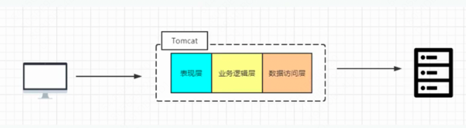
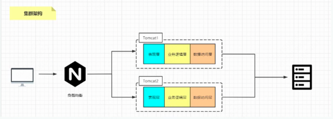
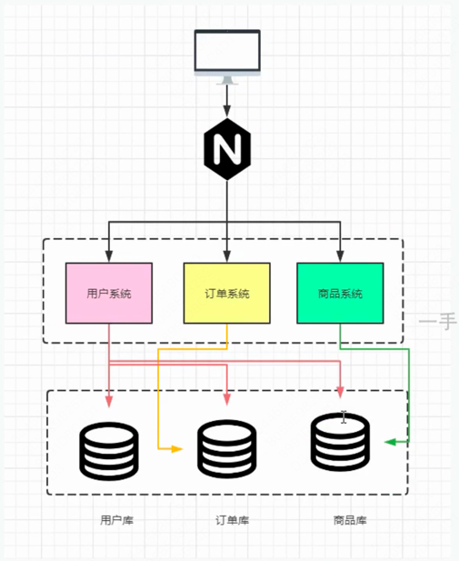
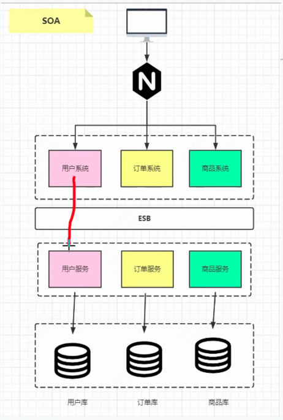
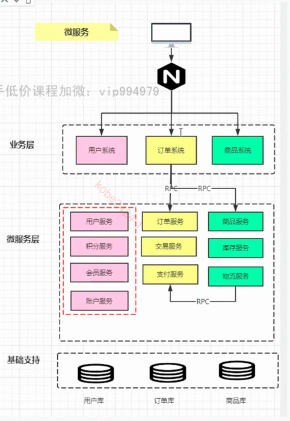
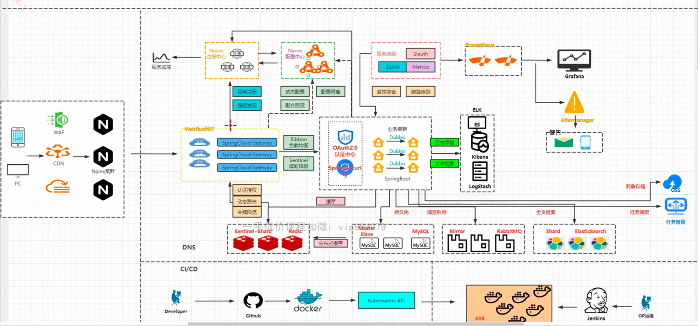
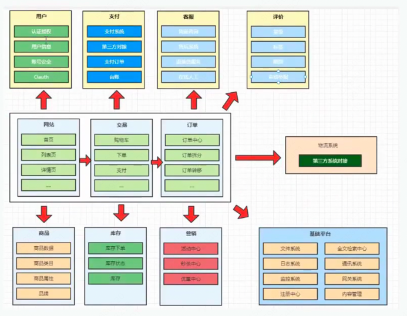

# 分布式三高商城系统
# 一、系统架构演变
### 1. 服务架构的演变
##### 1.1 单体架构
单体架构中使用经典的三层模型:表现层、业务逻辑层、数据访问层，所有模块都耦合在一起。

简单，高效，开发速度快，缺点是性能容易遇到瓶颈，扩展性差。



##### 1.2 单体架构-集群
将单体项目部署在多台服务器上, 使用nginx做负载均衡, 提高系统的并发处理能力。

缺点是维护成本高， 扩展性差， 难以进行水平扩展。



##### 1.3 垂直化
将单体项目按照业务进行拆分, 每个业务模块使用独立的服务器, 实现业务模块的解耦和独立部署。比如将一个商城系统拆分成订单系统、用户系统和商品系统

缺点是冗余代码多, 用户系统和商品系统中可能都有对商品的crud操作



##### 1.4 服务化
SOA(面向服务的架构), 将业务模块再拆分成更小的服务, 每个服务都提供特定的功能, 实现业务模块的解耦和独立部署。

ESB: 企业服务总线, 用于连接不同的服务, 实现服务之间的通信和集成。



##### 1.5 微服务化
在SOA的基础上继续演进就是我们讲的微服务了, SOA的服务进行更细粒度的拆分就是微服务。

随着服务拆分之后, 微服务架构下的 服务的注册、服务之间的发现、服务之间的调用、服务的治理等都需要做相应的处理。

并且对基础运维的能力要求会越来越高, 虚拟化、容器化等。



**微服务和SOA的区别:**
1. 思想上: 微服务的目的是解耦, 而SOA的目的是实现数据的互通和共享性。
2. 协议: 微服务会使用一些轻量级的通信协议(Restful API)
3. 基础设施要求: 微服务更加强调开发运维的持续交付(CICD)

# 二、项目介绍
### 1.三高介绍
三高指的是: 高性能(响应快)、高并发(并发能力强)、高可用(某个节点/服务宕机后, 整个应用的容灾能力还是强的)


### 2.项目架构
##### 2.1 项目架构图:



##### 2.2 业务组成:



##### 2.3 RPC框架

在微服务架构中，服务与服务之间要实现接口的调用我们肯定要通过相关的RPC(Remote Procedure Call)框架来实现。

常用的RPC框架有:Dubbo,Google的GRPC，Apache的Thrift，微博的Motan，京东的EasyRPC等。我们通过RPC框架可以取调用服务提供者提供的服务，但有一个前提是我们要能找到这个服务。通常我们的服务部署都是集群多节点的部署，所以在消费者这端就不可能直接写死在代码里面，这时就涉及到了服务的发现问题，这时就需要另一个组件注册中心了

#####  2.4 注册中心

注册中心实现服务地址管理的功能，解决服务动态感知(上线，下线)。

#####  2.5 负载均衡

在服务注册中心的介绍中我们可以看到负载均衡的应用。我们可以通过Ribbon来实现客户端的负载均衡，负载均衡的策略可以是：轮询，随机，根据响应时间来计算权重的轮询等。

#####  2.6 配置中心

在微服务架构中我们有很多个服务，而每个服务中是都会有单独的配置文件的。里面有很多的配置信息的有关联的，而且对于后期的更新维护也会非常的不方便，这时配置中心就上场了。常用的配置中心有：apollo/Nacos/disconf/zookeeper/diamond/Spring Cloud Config

#####  2.7 网关

网关可以帮助我们完成用户请求的入口，路由。完成统一授权，日志的记录，权限的认证和限流及熔断操作。

#####  2.8 限流、降级、缓存

在现实的微服务架构中的性能是很难满足所有的用户请求，这时我们就可以通过一些措施来保证我们的核心服务的正常运转。

限流：sentinel、hystrix

降级：主动降级(订单评论、广告关闭)、被动降级

缓存：降低数据源访问频率、Redis等

容错机制：服务出现挂机，宕机之后的处理机制。

##### 2.9 Bus

Bus消息总线，实现异步化的通信机制。

##### 2.10 链路监控

因为微服务中的服务实在是太多了，为了能更好的监控个服务的情况，肯定就需要链路监控服务，我们可以通过sleuth+zipkin来实现，应用层监控，系统级监控

# 三、环境准备
##### 3.1 虚拟机准备
这里我们准备的是阿里云服务器: https://swasnext.console.aliyun.com/servers/cn-beijing

##### 3.2 Docker安装
CentOS7安装Docker: https://docs.docker.com/engine/install/centos/

1. 卸载原有环境
```shell
sudo yum remove docker \ 
                  docker-client \ 
                  docker-client-latest \ 
                  docker-common \ 
                  docker-latest \ 
                  docker-latest-logrotate \ 
                  docker-logrotate \ 
                  docker-engine
```

2. 安装依赖环境和镜像地址
```shell
sudo yum install -y yum-utils
```

设置官方镜像地址
```shell
sudo yum-config-manager \
    --add-repo \
    https://download.docker.com/linux/centos/docker-ce.repo
```

设置阿里云镜像地址
```shell
sudo yum-config-manager \
    --add-repo \
    http://mirrors.aliyun.com/docker-ce/linux/centos/docker-ce.repo
```

安装docker CE
```shell
sudo yum install -y docker-ce docker-ce-cli containerd.io
```

启动docker
```shell
systemctl start docker
```

查询docker中正在运行的容器信息
```shell
# docker ps命令用于列出当前正在运行的Docker容器。它会显示容器的ID、名称、状态、端口映射等信息
docker ps

# CONTAINER ID   IMAGE     COMMAND   CREATED   STATUS    PORTS     NAMES
```

查询docker中所有容器信息, 不管有没有在运行
```shell
docker ps -a
```

删除docker容器
```shell
docker rm 容器ID
```

查看docker版本
```shell
docker version
```

设置docker服务开机自动启动
```shell
systemctl enable docker
```

##### 3.3 Docker中安装mysql数据库
为了后续做CICD, 我们在docker中安装必要软件

拉取mysql5.7镜像
```shell
docker pull mysql:5.7
```
> 因为docker国内被墙了, 所以我们需要使用国内的镜像仓库, 配置方法参考:https://blog.csdn.net/Lichen0196/article/details/137355517
> 但是这个blog中给出的镜像数据源也不太行, 镜像数据源可以使用:

```json
{
  "registry-mirrors": [
    "https://docker.fxxk.dedyn.io",
    "https://docker.m.daocloud.io",
    "https://docker.1panel.live"
  ]
}
```

查看docker镜像信息
```shell
docker images

# REPOSITORY   TAG       IMAGE ID       CREATED         SIZE
# mysql        5.7       5107333e08a8   11 months ago   501MB
```

基于mysql5.7镜像启动容器:
```shell
# 基于mysql5.7镜像启动容器, 容器中端口为3306(第二个), 宿主机端口也为3306(第一个), 容器名称为mysql, -v 数据挂载信息(容器中哪些目录下的信息挂载到宿主机的哪些目录下) -e: 设置root账号的默认密码为root
docker run -p 3306:3306 --name mysql -v /mydata/mysql/log:/var/log/mysql -v /mydata/mysql/data:/var/lib/mysql -v /mydata/mysql/conf:/etc/mysql/conf.d -e MYSQL_ROOT_PASSWORD=root -d mysql:5.7
```

docker启动mysql容器时, 发生了问题 容器一启动就挂, 可以通过以下命令查看容器日志
```shell
docker logs <container_id>
```

docker启动mysql容器立马挂掉, 通过日志看是不能读取'/etc/mysql/conf.d/目录的解决方法: https://www.cnblogs.com/wxxf/p/17854020.html

再次执行docker ps命令后, 确认mysql容器已经启动
```shell
[root@iZ2ze9afrj51kl498kmdwkZ ~]# docker ps
CONTAINER ID   IMAGE       COMMAND                  CREATED          STATUS          PORTS                               NAMES
2b138bd7cdd3   mysql:5.7   "docker-entrypoint.s…"   41 minutes ago   Up 41 minutes   0.0.0.0:3306->3306/tcp, 33060/tcp   mysql
```


# 四、业务开发


# 五、上线部署

