# 分布式三高商城系统
# 一、系统架构演变
### 1. 服务架构的演变
##### 1.1 单体架构
单体架构中使用经典的三层模型:表现层、业务逻辑层、数据访问层，所有模块都耦合在一起。

简单，高效，开发速度快，缺点是性能容易遇到瓶颈，扩展性差。


##### 1.2 单体架构-集群
将单体项目部署在多台服务器上, 使用nginx做负载均衡, 提高系统的并发处理能力。

缺点是维护成本高， 扩展性差， 难以进行水平扩展。


##### 1.3 垂直化
将单体项目按照业务进行拆分, 每个业务模块使用独立的服务器, 实现业务模块的解耦和独立部署。比如将一个商城系统拆分成订单系统、用户系统和商品系统

缺点是冗余代码多, 用户系统和商品系统中可能都有对商品的crud操作


##### 1.4 服务化
SOA(面向服务的架构), 将业务模块再拆分成更小的服务, 每个服务都提供特定的功能, 实现业务模块的解耦和独立部署。

ESB: 企业服务总线, 用于连接不同的服务, 实现服务之间的通信和集成。


##### 1.5 微服务化
在SOA的基础上继续演进就是我们讲的微服务了, SOA的服务进行更细粒度的拆分就是微服务。

随着服务拆分之后, 微服务架构下的 服务的注册、服务之间的发现、服务之间的调用、服务的治理等都需要做相应的处理。

并且对基础运维的能力要求会越来越高, 虚拟化、容器化等。


**微服务和SOA的区别:**
1. 思想上: 微服务的目的是解耦, 而SOA的目的是实现数据的互通和共享性。
2. 协议: 微服务会使用一些轻量级的通信协议(Restful API)
3. 基础设施要求: 微服务更加强调开发运维的持续交付(CICD)

# 二、项目介绍
### 1.三高介绍
三高指的是: 高性能(响应快)、高并发(并发能力强)、高可用(某个节点/服务宕机后, 整个应用的容灾能力还是强的)


### 2.项目架构
##### 2.1 项目架构图:


##### 2.2 业务组成:


##### 2.3 RPC框架

在微服务架构中，服务与服务之间要实现接口的调用我们肯定要通过相关的RPC(Remote Procedure Call)框架来实现。

常用的RPC框架有:Dubbo,Google的GRPC，Apache的Thrift，微博的Motan，京东的EasyRPC等。我们通过RPC框架可以取调用服务提供者提供的服务，但有一个前提是我们要能找到这个服务。通常我们的服务部署都是集群多节点的部署，所以在消费者这端就不可能直接写死在代码里面，这时就涉及到了服务的发现问题，这时就需要另一个组件注册中心了


#####  2.4 注册中心

注册中心实现服务地址管理的功能，解决服务动态感知(上线，下线)。


#####  2.5 负载均衡

在服务注册中心的介绍中我们可以看到负载均衡的应用。我们可以通过Ribbon来实现客户端的负载均衡，负载均衡的策略可以是：轮询，随机，根据响应时间来计算权重的轮询等。


#####  2.6 配置中心

在微服务架构中我们有很多个服务，而每个服务中是都会有单独的配置文件的。里面有很多的配置信息的有关联的，而且对于后期的更新维护也会非常的不方便，这时配置中心就上场了。常用的配置中心有：apollo/Nacos/disconf/zookeeper/diamond/Spring Cloud Config


#####  2.7 网关

网关可以帮助我们完成用户请求的入口，路由。完成统一授权，日志的记录，权限的认证和限流及熔断操作。


#####  2.8 限流、降级、缓存

在现实的微服务架构中的性能是很难满足所有的用户请求，这时我们就可以通过一些措施来保证我们的核心服务的正常运转。

限流：sentinel、hystrix

降级：主动降级(订单评论、广告关闭)、被动降级

缓存：降低数据源访问频率、Redis等

容错机制：服务出现挂机，宕机之后的处理机制。


##### 2.9 Bus

Bus消息总线，实现异步化的通信机制。


##### 2.10 链路监控

因为微服务中的服务实在是太多了，为了能更好的监控个服务的情况，肯定就需要链路监控服务，我们可以通过sleuth+zipkin来实现，应用层监控，系统级监控


# 三、环境准备
##### 3.1 虚拟机准备
这里我们准备的是阿里云服务器: https://swasnext.console.aliyun.com/servers/cn-beijing

##### 3.2 Docker安装
CentOS7安装Docker: https://docs.docker.com/engine/install/centos/

1. 卸载原有环境
```shell
sudo yum remove docker \ 
                  docker-client \ 
                  docker-client-latest \ 
                  docker-common \ 
                  docker-latest \ 
                  docker-latest-logrotate \ 
                  docker-logrotate \ 
                  docker-engine
```

2. 安装依赖环境和镜像地址
```shell
sudo yum install -y yum-utils
```

设置官方镜像地址
```shell
sudo yum-config-manager \
    --add-repo \
    https://download.docker.com/linux/centos/docker-ce.repo
```

设置阿里云镜像地址
```shell
sudo yum-config-manager \
    --add-repo \
    http://mirrors.aliyun.com/docker-ce/linux/centos/docker-ce.repo
```

安装docker CE
```shell
sudo yum install -y docker-ce docker-ce-cli containerd.io
```

启动docker
```shell
systemctl start docker
```

查询docker中正在运行的容器信息
```shell
# docker ps命令用于列出当前正在运行的Docker容器。它会显示容器的ID、名称、状态、端口映射等信息
docker ps

# CONTAINER ID   IMAGE     COMMAND   CREATED   STATUS    PORTS     NAMES
```

查询docker中所有容器信息, 不管有没有在运行
```shell
docker ps -a
```

删除docker容器
```shell
docker rm 容器ID
```

查看docker版本
```shell
docker version
```

设置docker服务开机自动启动
```shell
systemctl enable docker
```

##### 3.3 Docker中安装mysql数据库
为了后续做CICD, 我们在docker中安装必要软件

拉取mysql5.7镜像
```shell
docker pull mysql:5.7
```
> 因为docker国内被墙了, 所以我们需要使用国内的镜像仓库, 配置方法参考: https://blog.csdn.net/Lichen0196/article/details/137355517 <br/>
> 但是这个blog中给出的镜像数据源也不太行, 镜像数据源可以使用:

```json
{
  "registry-mirrors": [
    "https://docker.fxxk.dedyn.io",
    "https://docker.m.daocloud.io",
    "https://docker.1panel.live"
  ]
}
```

查看docker镜像信息
```shell
docker images

# REPOSITORY   TAG       IMAGE ID       CREATED         SIZE
# mysql        5.7       5107333e08a8   11 months ago   501MB
```

基于mysql5.7镜像启动容器:
```shell
# 基于mysql5.7镜像启动容器, 容器中端口为3306(第二个), 宿主机端口也为3306(第一个), 容器名称为mysql, -v 数据挂载信息(容器中哪些目录下的信息挂载到宿主机的哪些目录下) -e: 设置root账号的默认密码为root
docker run -p 3306:3306 --name mysql -v /mydata/mysql/log:/var/log/mysql -v /mydata/mysql/data:/var/lib/mysql -v /mydata/mysql/conf:/etc/mysql/conf.d -e MYSQL_ROOT_PASSWORD=199741Zy1! -d mysql:5.7
```

> 怎么修改mysql密码: https://blog.csdn.net/m0_37482190/article/details/133250569 (记一次狗黑客攻击)

docker启动mysql容器时, 发生了问题 容器一启动就挂, 可以通过以下命令查看容器日志
```shell
docker logs <container_id>
```

docker启动mysql容器立马挂掉, 通过日志看是不能读取'/etc/mysql/conf.d/目录的解决方法: https://www.cnblogs.com/wxxf/p/17854020.html

再次执行docker ps命令后, 确认mysql容器已经启动
```shell
[root@iZ2ze9afrj51kl498kmdwkZ ~]# docker ps
CONTAINER ID   IMAGE       COMMAND                  CREATED          STATUS          PORTS                               NAMES
2b138bd7cdd3   mysql:5.7   "docker-entrypoint.s…"   41 minutes ago   Up 41 minutes   0.0.0.0:3306->3306/tcp, 33060/tcp   mysql
```

在宿主机的/mydata/mysql/conf目录下设置配置文件my.cnf:
```xml
[client]
default-character-set=utf8

[mysql]
default-character-set=utf8

[mysqld]
init_connect="SET collation_connection = utf8_unicode_ci"
init_connect="SET NAMES utf8"
character-set-server=utf8
collation-server=utf8_unicode_ci
skip-character-set-client-handshake
skip-name-resolve
```
重启docker-mysql容器:
```shell
docker restart <container_id>

[root@iZ2ze9afrj51kl498kmdwkZ conf]# docker ps
CONTAINER ID   IMAGE       COMMAND                  CREATED       STATUS       PORTS                               NAMES
2b138bd7cdd3   mysql:5.7   "docker-entrypoint.s…"   4 hours ago   Up 4 hours   0.0.0.0:3306->3306/tcp, 33060/tcp   mysql
[root@iZ2ze9afrj51kl498kmdwkZ conf]# docker restart 2b
2b
```
连接数据库(root:root)

##### 3.4 Docker中安装Redis
拉取Redis最新版本镜像
```shell
docker pull redis
```

根据Redis镜像文件创建容器
```shell
# -d:后台运行 -p:端口映射 -v:数据挂载 --name:容器名称
docker run -d -p 6379:6379 --name mall-redis -v /mydata/redis/data:/data -v /mydata/redis/conf:/etc/redis  redis redis-server /etc/redis/redis.conf
```
这里我们给redis设置了密码 参考: https://blog.csdn.net/hecr_mingong/article/details/111690585

因为配置了目录挂载, 所以如果报错 `Fatal error, can't open config file '/etc/redis/redis.conf': No such file or directory`, 我们在/mydata/redis/conf下创建redis.conf文件即可

重新启动容器即可:
```shell
[root@iZ2ze9afrj51kl498kmdwkZ conf]# docker ps
CONTAINER ID   IMAGE       COMMAND                  CREATED         STATUS          PORTS                               NAMES
83bffad12ab5   redis       "docker-entrypoint.s…"   2 seconds ago   Up 1 second     0.0.0.0:6379->6379/tcp              mall-redis
2b138bd7cdd3   mysql:5.7   "docker-entrypoint.s…"   5 hours ago     Up 11 minutes   0.0.0.0:3306->3306/tcp, 33060/tcp   mysql
```

进入redis容器内部:
```shell
docker exec -it <container_id> /bin/bash
```

在redis容器内部尝试连接redis:
```shell
root@83bffad12ab5:/data# redis-cli
127.0.0.1:6379> set name zhangsan
OK
127.0.0.1:6379> get zhangsan
(nil)
127.0.0.1:6379> get name
"zhangsan"
```

设置mysql容器和redis容器开机自启动:
```shell
docker update --restart=always <container_id>
```

重要: 修改/mydata/redis/conf/redis.conf文件中的bind 127.0.0.1为bind 0.0.0.0(从只允许本机访问改成允许所有ip访问), 修改protected-mode为no。参考 https://developer.aliyun.com/article/792302

idea连接redis, ok

##### 3.5 本地开发环境准备
1. jdk 17
2. idea + web storm
3. git

##### 3.6 父工程创建
mall_zy(pom项目, 做版本控制用)

##### 3.7 相关微服务模块创建
- 商品 mall-product
- 订单 mall-order
- 会员 mall-member
- 库存 mall-ware
- 优惠活动 mall-coupon

> 解决git将子模块误认为子系统模块的问题(github文件夹有向右的白色箭头且不能打开): https://www.jianshu.com/p/28e61a24d847

##### 3.8 gitignore文件配置

##### 3.9 数据库表创建
- mall_pms 商品数据库
- mall_oms 订单数据库
- mall_ums 会员数据库
- mall_wms 库存数据库
- mall_sms 优惠活动数据库

执行./sql/下对应数据库的.sql文件, 在对应数据库下创建表

##### 3.10 服务创建和数据库配置
前端: Vue + ElementUI <br/>
后端: SpringBoot + MyBatisPlus

我们在本项目中使用人人开源中提供的模版项目来实现快速的项目构建: https://github.com/renrenio  https://gitee.com/renrenio

使用到的模版项目有:
- renren-fast: 后端模版
- renren-generator: 代码生成器
- renren-fast-vue: 前端模版

1. renren-fast: <br/>
修改renren-fast中application.yml配置文件, 创建对应的数据库 renren_fast

根据renren-fast/db/下的.sql文件创建数据库表

##### 3.11 后端服务启动配置
启动renren-fast服务, 启动类: RenrenApplication

##### 3.12 前端服务搭建
前端服务: renren-fast-vue

安装node.js

启动renren-fast-vue参考: https://github.com/renrenio/renren-fast-vue/wiki/Getting-started

> ps: 这个前端中用到的依赖 如node-sass等不支持mac的arm64架构, 前端项目放弃了

##### 3.13 generator系统搭建
使用renren-generator生成代码(通过模版文件生成)

修改renren-generator的application.yml, generator.properties配置文件, 生成我们各个数据库下的模版代码

启动renren-generator, 访问localhost:9999, 生成对应数据库的非业务crud代码

##### 3.14 common模块搭建
mall-common模块中存放一些公共的代码, 比如异常处理类, 工具类等

对renren-generator生成的代码修改导入的依赖, 修改报错的代码, 使项目能够正常启动

##### 3.15 mybatis-plus整合
添加mybatis-plus依赖, mysql数据库依赖
```xml
<!--mybatis-plus-->
<dependency>
    <groupId>com.baomidou</groupId>
    <artifactId>mybatis-plus-boot-starter</artifactId>
    <version>3.5.2</version>
    <scope>compile</scope>
</dependency>
<!--mysql-->
<dependency>
    <groupId>mysql</groupId>
    <artifactId>mysql-connector-java</artifactId>
    <version>8.0.11</version>
</dependency>
```

完成mybatis-plus的配置, mall-product: application.yaml

配置完成后在MallProductApplicationTests中测试成功

##### 3.16 各微服务代码生成
为mall_oms(9991), mall_pms(9990), mall_sms(9992), mall_ums(9993), mall_wms(9994)分别生成代码

##### 3.17 SpringCloud Netflix介绍


前端不要直接调用后端, 要经过nginx -> 网关

netflix已经不再维护了, 也没有springcloud alibaba好用, 不推荐使用

##### 3.18 SpringCloud Alibaba介绍
注意: springboot和spring cloud alibaba的版本要对应, 否则可能会有问题(官网有版本对应), 这里我们使用的是springboot 2.4.12, spring cloud alibaba 2021.1

我们会使用到的微服务组件:
- 注册中心: Nacos
- 配置中心: Nacos
- 负载均衡: Ribbon
- 声明式服务调用: OpenFeign
- 服务容错: Sentinel
- 网关: Gateway
- 链路监控: Sleuth
- 分布式事务: Seata
- 消息队列: RabbitMQ

##### 3.19 下载nacos服务
本机的nacos放在了/opt/nacos

linux/unix/mac下单机启动naocs服务(是一个springboot服务):
```shell
sh startup.sh -m standalone
```
服务启动之后访问localhost:8848/nacos即可


##### 3.20 nacos 微服务注册
1. 修改pom.xml文件 添加nacos依赖
```xml
<!--nacos服务注册-->
<dependency>
    <groupId>com.alibaba.cloud</groupId>
    <artifactId>spring-cloud-starter-alibaba-nacos-discovery</artifactId>
</dependency> 
```

2. 启动类上加 @EnableDiscoveryClient 注解

3. 修改application.yml文件, 添加nacos配置
```yaml
spring:
  cloud:
    nacos:
      discovery:
        server-addr: localhost:8848 
```

注意, 我们还需要导入spring-cloud-starter-bootstrap依赖, 否则报错ClassNotFoundException
```xml
  <dependencies>
    <dependency>
      <groupId>org.springframework.cloud</groupId>
      <artifactId>spring-cloud-starter-bootstrap</artifactId>
      <version>3.0.3</version>
    </dependency>
  </dependencies>
```
完成其他微服务模块的注册中心配置(1.pom.xml 2.启动类 3.application.yaml)

##### 3.21 Doker容器中安装
在docker中安装nacos

拉取nacos镜像文件
```shell
docker pull nacos/nacos-server:latest
```

> 这里我们nacos的版本是2.4.3

启动nacos容器:
```shell
# -d 后台运行模式 -e 设置环境变量 -v 设置挂载目录 --name 设置容器名称 -p 设置端口映射 nacos/nacos-server:1.4.2 镜像名称
docker run -d -e MODE=standalone -v /mydata/nacos/conf:/home/nacos/conf --name nacos -p 8848:8848 -p 8849:8849 -p 9848:9848 -p 9849:9849 nacos/nacos-server:latest
```

然后需要:
1. 在/mydata/nacos/conf下新增配置文件
2. 修改nacos的数据源为mysql
3. 修改nacos的账号密码, 参考: https://nacos.io/docs/latest/manual/admin/auth/
```shell
(base) zhaoyu@MBP-W12T7NRJFQ-1817 ~ % curl -X POST '8.152.0.119:8848/nacos/v1/auth/users/admin' -d 'password=nacos' 
{"username":"nacos","password":"nacos"}
```
4. 配置nacos开机启动
```shell
docker update --restart=always nacos
```
5. 修改我们微服务模块的nacos配置

```yaml
spring:
  cloud:
    nacos:
      discovery:
        server-addr: 8.152.0.119:8848
        username: nacos
        password: nacos
```
##### 3.22 OpenFeign服务调用
OpenFeign是一个声明式的服务调用组件, 本质上是封装了Ribbon和RestTemplate, 实现了负载均衡和Rest调用, 我们用它来实现服务间的调用

1. 在服务提供者模块中定义服务提供接口
2. 在服务消费者中调用服务提供者的服务

我们用 mall-order(服务调用者) 和 mall-product(服务提供者) 来做服务调用测试

1. mall-product -> BrandController (服务提供者):
```java
    //OpenFeign服务提供接口
    @GetMapping("/all")
    public R queryAllBrand(){
        BrandEntity brandEntity = new BrandEntity();
        brandEntity.setName("huawei");
        brandEntity.setBrandId(100L);
        return R.ok().put("brands", brandEntity);
    }
```
2. mall-order (服务调用)
- 引入相关的依赖
```xml
<!--openfeign-->
<dependency>
    <groupId>org.springframework.cloud</groupId>
    <artifactId>spring-cloud-starter-openfeign</artifactId>
</dependency>
<!--load balancer组件 openfeign调用者必备-->
<dependency>
    <groupId>org.springframework.cloud</groupId>
    <artifactId>spring-cloud-starter-loadbalancer</artifactId>
    <version>3.1.0</version>
</dependency>
```
- 创建对应的Feign接口: ProductOpenFeignService
```java
@FeignClient(name="mall-product") // 说明要调用的服务名称
public interface ProductOpenFeignService {

    //需要访问的远程方法
    @GetMapping("mallproduct/brand/all")
    public R queryAllBrand();
}
```
- 启动类新增@EnableFeignClients注解， 开启远程调用功能
```java
@SpringBootApplication
@MapperScan("com.zy.mallorder.dao")
@EnableDiscoveryClient
@EnableFeignClients(basePackages = "com.zy.mallorder.feign")
public class MallOrderApplication {

    public static void main(String[] args) {
        SpringApplication.run(MallOrderApplication.class, args);
    }

}
```
3. 测试 访问localhost:9991/malloms/order/feign
```java
@RestController
@RequestMapping("malloms/order")
public class OrderController {
    @Autowired
    private OrderService orderService;

    @Autowired
    private ProductOpenFeignService productOpenFeignService;

    //测试openFeign服务调用
    @GetMapping("feign")
    public R testFeign() {
        return productOpenFeignService.queryAllBrand();
    }
}
```

**测试:** 
0. 启动mall-product和mall-order服务
1. mall-product和mall-order都注册到了nacos
2. 访问 http://localhost:9991/malloms/order/feign, 成功返回结果

##### 3.23 Nacos配置中心基本使用
在mall-order测试nacos配置中心使用

1. 引入nacos-config依赖
```xml
<!--nacos配置中心-->
<dependency>
    <groupId>com.alibaba.cloud</groupId>
    <artifactId>spring-cloud-starter-alibaba-nacos-config</artifactId>
    <version>2021.1</version>
</dependency>
```

2. 创建bootstrap.yaml文件, 添加nacos配置中心配置(bootstrap加载顺序优先于application)
```yaml
server:
  port: 9991

spring:
  application:
    name: mall-order
  cloud:
    # ncaos配置
    nacos:
      discovery:
        server-addr: 8.152.0.119:8848 # Nacos服务注册中心地址
      config:
        server-addr: 8.152.0.119:8848 # Nacos配置中心地址
        file-extension: yaml # 指定加载yaml后缀的配置文件
        group: DEFAULT_GROUP # 指定服务所在的分组 TEST_GROUP or DEV_GROUP
        # namespace: 70f309cd-313e-47ab-85ed-23e713b79a31 # 指定服务在哪个命名空间下面
```

3. 添加@RefreshScope注解打开配置信息动态刷新功能
```java
@RestController
@RequestMapping("malloms/order")
@RefreshScope
public class OrderController {
    @Value("${username}")
    private String username;

    @Value("${password}")
    private String password;

    //测试nacos配置中心
    @GetMapping("/config")
    public R queryConfig() {
        return R.ok().put("username", username).put("password", password);
    }
}
```

4. 在nacos控制台中添加配置文件, 发布配置文件 (ps:配置中心中的配置信息优先于application.yaml中的配置信息)


5. 测试: 启动mall-order服务 访问 localhost:9991/malloms/order/config, 成功返回 `{"msg":"success","password":"123456","code":0,"username":"zhaoyu93"}`

6. 为其他微服务新增bootstrap配置文件

##### 3.24 命名空间和配置组
可以通过dataId、group、namespace 三种方式进行配置文件隔离

为每个微服务创建一个配置命名空间


然后通过配置分组来区分 dev, test, prod环境

##### 3.25 配置拆分
我们现在是将某个服务中的所有配置都写在了同一个配置文件中, 这样会导致配置文件过大, 难以维护, 配置拆分后, 配置文件就变小了, 也方便维护了

mybatis相关配置:


datasource相关配置:


bootstrap.yaml配置:

```yaml
server:
  port: 9991

spring:
  application:
    name: mall-order
  cloud:
    # ncaos配置
    nacos:
      discovery:
        server-addr: 8.152.0.119:8848 # Nacos服务注册中心地址
      config:
        server-addr: 8.152.0.119:8848 # Nacos配置中心地址
        file-extension: yaml # 指定加载yaml后缀的配置文件
        group: DEFAULT_GROUP # 指定服务所在的分组 eg: TEST_GROUP or DEV_GROUP
        namespace: 56f80f04-c3b2-440a-a28b-4cb24426fd83 # 指定服务在哪个命名空间下面
        ext-config[0]:date-id: mall-order-mybatis # 指定多个配置文件
        ext-config[0].group: test
        ext-config[0]:refresh: false

        ext-config[1]:date-id: mall-order-datasource # 指定多个配置文件
        ext-config[1].group: test
        ext-config[1]:refresh: false
```
##### 3.26 Gateway核心概念介绍
客户端不可能记下每一个微服务的地址, 因此我们需要网关来路由, 此外网关还可以实现限流、鉴权、统一日志记录等功能

Spring Cloud Gateway 最重要的三个概念:
- 路由(route): 路由是网关最基础的部分, 路由信息包括ID、目标URI、匹配条件、过滤器信息等
- 断言(predicate): 路由条件, 例如请求方法、请求路径等
- 过滤器(filter): 过滤器用于修改请求和响应的信息


> spring cloud gateway 为我们提供了一些现成的predicates(断言)和filters(过滤器)
> 请求到网关 -> 断言 -> 过滤器 -> 路由到对应微服务 -> 过滤器 -> 返回结果


示例配置文件:
```yaml
server:
  port: 9999

spring:
  main:
    web-application-type: reactive
  application:
    name: cloud-gateway-service
  cloud:
    nacos:
      discovery:
        server-addr: localhost:8848
    gateway:
      discovery:
        locator:
          enabled: true # 开启注册中心路由功能, 把网关服务注册到naocs中
      routes:
        # 路由1
        - id: nacos-provider
          uri: http://localhost:9001/nacos-provider # 匹配提供服务的路由地址
          predicates:
            - Path=/gateway/** # 断言, 路径相匹配则进行路由, 访问http://localhost:9001/nacos-provider/gateway/** 时匹配
        # 路由2
        - id: nacos-provider2
          uri: http://localhost:9001/nacos-provider # 匹配提供服务的路由地址
          predicates:
            - Path=/route/** # 断言, 路径相匹配则进行路由
```

##### 3.27 Gateway网关服务搭建
创建网关服务模块 mall-gateway(9995)

1. pom.xml中添加对应的依赖:
```xml
        <!--nacos服务注册-->
        <dependency>
            <groupId>com.alibaba.cloud</groupId>
            <artifactId>spring-cloud-starter-alibaba-nacos-discovery</artifactId>
        </dependency>
        <!--gateway依赖-->
        <dependency>
            <groupId>org.springframework.cloud</groupId>
            <artifactId>spring-cloud-starter-gateway</artifactId>
            <version>${spring-cloud-gateway.version}</version>
        </dependency>
        <!--loadbalancer负载均衡组件, 必须加 否则gateway无法实现负载均衡-->
        <dependency>
            <groupId>org.springframework.cloud</groupId>
            <artifactId>spring-cloud-starter-loadbalancer</artifactId>
            <version>3.0.1</version>
        </dependency>
```
2. 完成配置
bootstrap.yaml:

```yaml
server:
  port: 9995

spring:
  application:
    name: mall-gateway
  cloud:
    # ncaos配置
    nacos:
      discovery:
        server-addr: 8.152.0.119:8848 # Nacos服务注册中心地址
      config:
        server-addr: 8.152.0.119:8848 # Nacos配置中心地址
        file-extension: yaml # 指定加载yaml后缀的配置文件
        group: DEFAULT_GROUP # 指定服务所在的分组 eg: TEST_GROUP or DEV_GROUP
        # namespace: 56f80f04-c3b2-440a-a28b-4cb24426fd83 # 指定服务在哪个命名空间下面
        #        ext-config[0]:date-id: mall-order-mybatis # 指定多个配置文件
        #        ext-config[0].group: test
        #        ext-config[0]:refresh: false
        #
        #        ext-config[1]:date-id: mall-order-datasource # 指定多个配置文件
        #        ext-config[1].group: test
        #        ext-config[1]:refresh: false

    # 配置路由
    gateway:
      routes:
        # 如果请求的url中包含baidu，则路由到百度
        - id: route1
          uri: http://www.baidu.com
          predicates:
            - Query=url,baidu
        # 如果请求的url中包含taobao，则路由到淘宝
        - id: route2
          uri: http://www.taobao.com
          predicates:
            - Query=url,taobao


```

3. 启动mall-gateway服务 测试网关服务路由规则
- 网关服务成功注册到了nacos
- 访问 localhost:9995/?url=baidu, 成功路由到百度; 访问 localhost:9995/?url=taobao, 成功路由到淘宝

# 四、业务开发
前端模版服务: renren-ui (需要使用node v16.0.0 -> nvm use 16.0.0 否则报错)

后端模版服务: renren-security

### 0.1 业务开发方向拆解
1. 维护基础数据 - 商品分类、商品品牌、商品规格、商品属性、商品SPU、商品SKU

基于renren-security模版和renren-ui模版开发

## 1. 后台管理系统

## 1. 业务开发 - 三级类目操作

### 1.1 商品分类后台查询
执行pms_category.sql 初始化商品分类数据

> 接口测试记录参考postman

mall-product -> CategoryController
- 新增listTree接口, postman测试接口 通过

> compareTo方法升降序是如何确定的: https://blog.csdn.net/weixin_45505313/article/details/130705913

### 1.2 菜单维护
1. 在renren-ui前端页面上新增【商品系统】一级菜单
2. 在【商品系统】下新增【类别管理】菜单, 路由填写 mallproduct/category。ps: 菜单信息维护在renren-security的sys_menu表中
3. 修改renren-ui, 新增mall/product/category.vue页面, 确保页面能够正确跳转, 页面内容参考renren-ui


### 1.3 数据展示 & renren-security 服务注册
vue + element ui 实现数据展示

element ui 组件: https://element.eleme.cn/#/zh-CN/component/installation

模版服务中, 前端默认请求的url是人人模版后端: http://localhost:9998/renren-admin

但是现在我们的服务架构如下图:


因此需要引入网关服务(mall-gateway 9995), 前端只请求网关服务, 网关服务完成后续服务的路由 (修改renren-ui的.env文件)

修改renren-ui的.env文件, 将后端请求地址改为网关服务

接下来我们需要让renren-security注册到nacos中, 这样网关才能将其路由到。

##### renren-security服务注册
1. renren-security使用的是较高版本的springboot 3.2.6, 因此我们要用spring cloud alibaba 2023.x 来与其兼容
```xml
<dependency>
    <groupId>com.alibaba.cloud</groupId>
    <artifactId>spring-cloud-starter-alibaba-nacos-config</artifactId>
    <version>2023.0.1.0</version>
</dependency>
<dependency>
    <groupId>com.alibaba.cloud</groupId>
    <artifactId>spring-cloud-starter-alibaba-nacos-discovery</artifactId>
    <version>2023.0.1.0</version>
</dependency>
<dependency>
    <groupId>org.springframework.cloud</groupId>
    <artifactId>spring-cloud-starter-bootstrap</artifactId>
    <version>4.0.0</version>
</dependency> 
```
2. 高版本的nacos默认使用grpc的方式和服务器通信(低版本用http), 因此我们需要把阿里云服务器以及docker中打开8848, 8849, 9848(8848+1000), 9849(8848+1001)端口

docker 指定8848, 8849, 9848, 9849映射端口启动容器:
```shell
docker run -d -e MODE=standalone -v /mydata/nacos/conf:/home/nacos/conf --name nacos -p 8848:8848 -p 8849:8849 -p 9848:9848 -p 9849:9849 nacos/nacos-server:latest
```

### 1.4 网关路由
通过配置网关服务的路由, 将前端请求路由到对应的服务

mall-gateway -> bootstrap.yaml

```yaml
spring:
  application:
    name: mall-gateway
  cloud:
    # ncaos配置
    nacos:
      discovery:
        server-addr: 8.152.0.119:8848 # Nacos服务注册中心地址
      config:
        server-addr: 8.152.0.119:8848 # Nacos配置中心地址
        file-extension: yaml # 指定加载yaml后缀的配置文件
        group: DEFAULT_GROUP # 指定服务所在的分组 eg: TEST_GROUP or DEV_GROUP

    # 配置路由
    gateway:
      routes:
        # renren-admin路由
        - id: renren-admin
          uri: lb://renren-admin
          predicates:
            - Path=/renren-admin/**
```
但是此时还是请求不到renren-admin服务, 因为mall-gateway服务没有配置允许跨域请求

报错 `:8001/#/login:1 Access to XMLHttpRequest at 'http://localhost:9995/renren-admin/login' from origin 'http://172.18.141.186:8001' has been blocked by CORS policy: Response to preflight request doesn't pass access control check: No 'Access-Control-Allow-Origin' header is present on the requested resource.`

> 跨域: 协议 or 域名 or 端口

浏览器访问非同源服务器流程: <br/>


##### 解决跨域请求流程
**问题原因:** 跨域根本原因是由同源策略引起的。所谓同源是指域名，协议，端口相同，当页面在执行一个脚本时会检查访问的资源是否同源，如果非同源，在请求数据的时候浏览器会在控制台报一个异常，提示拒绝访问。注意：跨域限制访问，其实是浏览器的限制。理解这一点很重要！！！

**解决跨域问题的方法 - CORS方式解决跨域(常见, 仅修改服务端即可):**

CORS 全称是"跨域资源共享"（Cross-origin resource sharing）。CORS需要浏览器和服务器同时支持，但是目前基本上浏览器都支持，所以我们只要保证服务器端服务器实现了 CORS 接口，就可以跨域通信

实现方式：在响应头配置 Access-Control-Allow-Origin 字段以后,数据包发送给浏览器后，浏览器就会根据这里配置的白名单 “放行” 允许白名单的服务器对应的网页来用 ajax 跨域访问 。

- Access-Control-Allow-Origin             允许请求的域
- Access-Control-Allow-Methods            允许请求的方法
- Access-Control-Allow-Headers            预检请求后，告知发送请求需要有的头部
- Access-Control-Allow-Credentials        表示是否允许发送cookie，默认false；
- Access-Control-Max-Age                  本次预检的有效期，单位：秒；

> 在解决跨域问题的路途上, 我先尝试了WebMvcConfigurer, 发现无法生效, 更换为CorsWebFilter后生效

删除renren-security的跨域配置, 否则报错`Access to XMLHttpRequest at 'http://localhost:9995/renren-admin/login' from origin 'http://172.18.141.186:8001&#39;  has been blocked by CORS policy: The 'Access-Control-Allow-Origin' header contains multiple values 'http://172.18.141.186:8001,  http://172.18.141.186:8001&#39;,  but only one is allowed.`

这是因为有不止一个地方添加了响应头的Access-Control-Allow-Origin属性, Access-Control-Allow-Origin包含了多个值, 根据CORS规范, 这个响应头只能有一个值

### 1.5 查看类别数据
配置网关的商品服务路由(**注意路由配置的顺序**):

```yaml
spring:
  application:
    name: mall-gateway
  cloud:
    # ncaos配置
    nacos:
      discovery:
        server-addr: 8.152.0.119:8848 # Nacos服务注册中心地址
      config:
        server-addr: 8.152.0.119:8848 # Nacos配置中心地址
        file-extension: yaml # 指定加载yaml后缀的配置文件
        group: DEFAULT_GROUP # 指定服务所在的分组 eg: TEST_GROUP or DEV_GROUP
        # namespace: 56f80f04-c3b2-440a-a28b-4cb24426fd83 # 指定服务在哪个命名空间下面

    # 配置路由
    gateway:
      routes:
        # 商品系统路由, 注意路由顺序 别让Path=/renren-admin/**把前面的路由给拦截了        
        - id: mall-product-route
          uri: lb://mall-product
          predicates:
            - Path=/renren-admin/mallproduct/**
          filters:
            - StripPrefix=1 # 去掉路径上的前缀1层 renren-admin
        # renren-admin路由
        - id: renren-admin-route
          uri: lb://renren-admin
          predicates:
            - Path=/renren-admin/**
```
启动网关服务, renren-admin服务(后端基础功能), mall-product服务(商品服务)

前端 -> 网关 -> 路由 -> mall-product / renren-admin 成功跑通

修改renren-ui的category.vue页面, 使得返回的三级品类数据能够正确显示:


### 1.6 删除类别数据
1. 修改renren-ui 的category.vue页面, 新增: 添加删除按钮(附带展示逻辑); 新增复选框

2. CategoryController -> delete 批量删除接口, 使用Postman测试/mallproduct/category/delete接口 <br/>
为CategoryEntity类新增逻辑删除判断字段isDeleted, 默认值为0, 删除时更新为1, 同时为pms_category表新增is_Deleted字段

3. 修改 CategoryController -> delete 接口逻辑

4. 修改renren-ui, 新增点击 添加/删除按钮后的逻辑 **element-ui组件库只兼容vue2, 我们使用的是vue3, 所以需要安装element-plus 为了使用其中的elmessagebox, elmessage组件; node版本适用v16.0.0**

5. 完成类别删除功能

### 1.7 新增类别信息

> element-plus组件库地址: https://element-plus.org/zh-CN

1. 修改renren-ui 的category.vue页面, 新增: 点击添加按钮 跳出添加类目详情对话框(el-dialog), 添加完成后调用 mallproduct/category/save接口保存数据

2. 完成类别新增功能

### 1.8 更新类别
1. 修改renren-ui 的category.vue页面, 新增: 点击编辑按钮 跳出编辑类目详情对话框(el-dialog), 编辑完成后调用 mallproduct/category/update接口更新数据

2. 完成类别编辑功能

### 1.9 拖拽页面效果
实现拖拽三级类目的效果

1. 修改renren-ui 的category.vue页面, 新增: 实现三级类目拖拽效果(拖拽后不能破坏最大分类层级为三级的规则)

2. 修改后端逻辑, 使得前端拖拽类目后, 后端对应类目的parentCid, catLevel, sort字段也更新。在CategoryController接口中新增updateBatch接口, 批量更新类目数据

3. 完成拖拽功能

4. 修改renren-ui 的category.vue页面, 新增switch控件, 控制拖拽功能开关

### 1.10 批量删除类目数据
1. 修改renren-ui 的category.vue页面, 新增: 批量删除按钮, 批量删除后调用/mallproduct/category/delete接口批量删除数据

2. 完成批量删除功能

## 2. 业务开发 - 品牌管理
### 2.1 品牌crud基本操作

> 重要: 模版服务前端renren-ui和后端renren-security是配套的, 我们之前的前端模版用的是renren-ui, 后端用的是renren-fast。这次把后端模版替换为renren-security, 在renren-security分支上进行开发

1. 在前端页面上新增【品牌管理】菜单, 其父菜单为【商品系统】, 路由为/mallproduct/brand

2. 生成模版前端页面 brand.vue

3. 实现品牌管理crud基本功能

### 2.2 品牌管理 - 显示状态优化

### 2.3 阿里云OSS服务开通和使用
1. 我们将图片存放在阿里云OSS服务器上, 方便各个微服务进行访问。 阿里云oss控制台: https://oss.console.aliyun.com/overview


> oss学习路径: https://help.aliyun.com/zh/oss/

> 阿里云oss服务 api文档: https://help.aliyun.com/zh/oss/developer-reference/description?spm=a2c4g.11186623.help-menu-31815.d_3_2_0.7ec3b930QfGlyk

相关术语介绍:


2. 新建 `mall-bucket-zy` bucket

> 配置环境变量secret-id,secret-key等, 详情见阿里云oss java sdk 【快速入门】 https://help.aliyun.com/zh/oss/developer-reference/getting-started?spm=a2c4g.11186623.help-menu-31815.d_3_3_0_4.72a15c719jlR9V&scm=20140722.H_32011._.OR_help-V_1#f033b3702421e

3. 使用阿里云oss api上传文件 mall-product -> MallProductApplicationTests -> testUploadFile() `参考[阿里云API文档](https://help.aliyun.com/zh/oss/developer-reference/list-of-operations-by-function?spm=a2c4g.11186623.help-menu-31815.d_3_2_1.6f2354b5wgWyLJ)`

参考阿里云oss java sdk文档, 导入依赖:

```xml
        <!--阿里云oss sdk-->
        <dependency>
            <groupId>com.aliyun.oss</groupId>
            <artifactId>aliyun-sdk-oss</artifactId>
            <version>3.17.4</version>
        </dependency>
        <dependency>
            <groupId>javax.xml.bind</groupId>
            <artifactId>jaxb-api</artifactId>
            <version>2.3.1</version>
        </dependency>
        <dependency>
            <groupId>javax.activation</groupId>
            <artifactId>activation</artifactId>
            <version>1.1.1</version>
        </dependency>
        <!-- no more than 2.3.3-->
        <dependency>
            <groupId>org.glassfish.jaxb</groupId>
            <artifactId>jaxb-runtime</artifactId>
            <version>2.3.3</version>
        </dependency>
```

参考阿里云oss java sdk 上传文件 -> 上传文件流demo代码, 修改testUploadFile()方法 `注意需要设置access-key-id和access-key-secret环境变量`

```java
@SpringBootTest
public class Test{
    /**
     * 阿里云oss 上传文件测试
     * */
    @Test
    public void testUploadFile() throws Exception {
        // Endpoint以华东1（杭州）为例，其它Region请按实际情况填写。
        String endpoint = "https://oss-cn-beijing.aliyuncs.com";
        // 从环境变量中获取访问凭证。运行本代码示例之前，请确保已设置环境变量OSS_ACCESS_KEY_ID和OSS_ACCESS_KEY_SECRET。
        EnvironmentVariableCredentialsProvider credentialsProvider = CredentialsProviderFactory.newEnvironmentVariableCredentialsProvider();
        // 填写Bucket名称，例如examplebucket。
        String bucketName = "mall-bucket-zy";
        // 填写Object完整路径，完整路径中不能包含Bucket名称，例如exampledir/exampleobject.txt。
        String objectName = "exampledir/表格.pdf";
        // 填写本地文件的完整路径，例如D:\\localpath\\examplefile.txt。
        // 如果未指定本地路径，则默认从示例程序所属项目对应本地路径中上传文件流。
        String filePath= "/Users/zhaoyu/Desktop/表格.pdf";
        // 填写Bucket所在地域。以华东1（杭州）为例，Region填写为cn-hangzhou。
        String region = "cn-beijing";

        // 创建OSSClient实例。
        ClientBuilderConfiguration clientBuilderConfiguration = new ClientBuilderConfiguration();
        clientBuilderConfiguration.setSignatureVersion(SignVersion.V4);
        OSS ossClient = OSSClientBuilder.create()
                .endpoint(endpoint)
                .credentialsProvider(credentialsProvider)
                .clientConfiguration(clientBuilderConfiguration)
                .region(region)
                .build();

        try {
            InputStream inputStream = new FileInputStream(filePath);
            // 创建PutObjectRequest对象。
            PutObjectRequest putObjectRequest = new PutObjectRequest(bucketName, objectName, inputStream);
            // 创建PutObject请求。
            PutObjectResult result = ossClient.putObject(putObjectRequest);
        } catch (OSSException oe) {
            System.out.println("Caught an OSSException, which means your request made it to OSS, "
                    + "but was rejected with an error response for some reason.");
            System.out.println("Error Message:" + oe.getErrorMessage());
            System.out.println("Error Code:" + oe.getErrorCode());
            System.out.println("Request ID:" + oe.getRequestId());
            System.out.println("Host ID:" + oe.getHostId());
        } catch (ClientException | FileNotFoundException ce) {
            System.out.println("Caught an ClientException, which means the client encountered "
                    + "a serious internal problem while trying to communicate with OSS, "
                    + "such as not being able to access the network.");
            System.out.println("Error Message:" + ce.getMessage());
        } finally {
            if (ossClient != null) {
                ossClient.shutdown();
            }
        }
    }
}
```

上传成功:


### 2.4 SpringCloud Alibaba OSS 操作
alibaba的Springboot starter好像有点问题, 不一定能支持到springboot 3.2这么高的版本, 还是使用上述的方法完成springboot和oss的整合吧

可以参考: [【案例实战】SpringBoot整合阿里云文件上传OSS](https://developer.aliyun.com/article/1227235)

### 2.5 图片上传的各种方式介绍
1. 浏览器 -> 商品服务 -> oss服务器(大文件上传时, 后端服务压力大, 影响正常的业务流程)

要做两次大文件上传操作


2. 浏览器 -> 商品服务
   浏览器 -> oss服务器 (前端上传图片到oss, 把图片在oss上的地址传给后端; access-key, access-secret需要存到前端 不安全)


3. 浏览器 -> 商品服务 (获得图片的阿里云防伪签名)
   浏览器 -> oss服务器 (根据防伪签名把图片上传到oss服务器)

既提高了效率, 有保证了安全


### 2.6 third-party服务创建
创建mall-third-party服务 用于处理第三方服务, 比如阿里云oss防伪签名获取, 短信发送服务等第三方服务

测试Springboot整合阿里云oss操作 -> MallThridPartyApplicationTests :: aliyunOssUploadFile

### 2.7 服务端签名服务
服务端生成签名参考: [阿里云oss web端直传实践 - 服务端签名直传](https://help.aliyun.com/zh/oss/use-cases/obtain-signature-information-from-the-server-and-upload-data-to-oss?scm=20140722.S_help%40%40文档%40%4031926.S_BB1%40bl%2BRQW%40ag0%2BBB2%40ag0%2Bhot%2Bos0.ID_31926-RL_签名-LOC_doc%7EUND%7Eab-OR_ser-V_4-P0_0&spm=a2c4g.11186623.0.i4)


整体步骤:
1. 配置oss服务的跨域规则
2. 配置用户权限, 获取access-key和access-secret, 并将其设置到服务段代码的环境变量中
3. 服务器接收到Web端发送的用户上传文件的请求后，使用自己的长期凭证（accessKeyId和accessKeySecret）向阿里云STS请求一个临时授权凭证，这个临时凭证将授权Web端在限定的时间内对特定资源进行操作。临时访问凭证的使用应限制在最小必要范围内。
4. 服务端构建上传策略, 您可以根据您的业务需求在请求中构建请求策略，这些策略可能包括但不限于文件的最大尺寸、文件存储的具体位置以及请求的有效期限等。
5. 服务端计算签名, 在Web端能够发起上传请求之前，服务器需要基于前面定义的策略生成一个数字签名。这个签名用于验证请求的合法性和完整性。您可以通过控制台直接生成签名，也可以参考以下内容在您的代码中实现。
6. 服务端将所有必要的信息（包括但不限于签名、STS Token、Policy等）组织成适合HTTP POST请求的数据格式，以便于Web端使用这些数据构建上传请求。

新增OSSController以及getOssToken接口, 接口测试见postman

配置网关路由:
```yaml
server:
  port: 9995

spring:
  application:
    name: mall-gateway
  cloud:
    # ncaos配置
    nacos:
      discovery:
        server-addr: 8.152.0.119:8848 # Nacos服务注册中心地址
      config:
        server-addr: 8.152.0.119:8848 # Nacos配置中心地址
        file-extension: yaml # 指定加载yaml后缀的配置文件
        group: DEFAULT_GROUP # 指定服务所在的分组 eg: TEST_GROUP or DEV_GROUP

    # 配置路由
    gateway:
      routes:
        # 商品系统路由, 注意路由顺序 别让Path=/renren-admin/**把前面的路由给拦截了
        - id: mall-product-route
          uri: lb://mall-product
          predicates:
            - Path=/renren-admin/mallproduct/**
          filters:
            - StripPrefix=1 # 去掉路径上的前缀1层 renren-admin
        # 第三方服务路由
        - id: mall-third-party-route
          uri: lb://mall-third-party
          predicates:
            - Path=/renren-admin/oss/**
          filters:
            - StripPrefix=1 # 去掉路径上的前缀1层 renren-admin
        # renren-admin路由
        - id: renren-admin-route
          uri: lb://renren-admin
          predicates:
            - Path=/renren-admin/**

#          filters:
#            - RewritePath=/renren-admin/(?<segment>.*),/renren-admin/$\{segment}
```

### 2.8 上传图片功能实现
整体流程:
1. 阿里云OSS配置跨域
2. 后端服务签名实现(这里没有用角色扮演, 直接用子账号zhaoyu93生成的签名) 实现细节见 OssServiceImpl#getOssToken
3. 前端向阿里云oss提交表单, 携带签名信息, 具体见 singleUpload.vue

### 2.9 添加和修改功能完善
配置品牌管理页面显示我们上传到阿里云oss的图片, 需要打开bucket的权限, 并且不要开启阻止公共访问 否则无法访问 参考:https://developer.aliyun.com/article/1052776

代码参考 brand.vue


### 2.10 前端表单数据校验
前端校验: 对前端添加修改品牌的dialog进行表单校验(主要使用表单的rules属性完成), 参考 brand-add-or-update.vue

### 2.11 JSR-303校验实现
后端校验(前端校验不能覆盖所有情况 eg:直接请求接口就可以跳过前端校验): 利用aop的思想 + JSR303规范 完成校验

JSR是Java Specification Requests的缩写, 意思是Java规范提案, 是指向JCP(Java Community Process)提出新增一个标准化技术规范的正式请求, 任何人都可以提交JSR 以向Java平台增添新的API和服务。JSR已成为Java的一个重要标准。

JSR-303是Java EE 6的一项子规范, 叫做Bean Validation。Hibernate Validator是JSR-303的参考实现, Hibernate Validator提供了JSR-303规范中所有内置Constraint的实现, 除此以外还有一些附加的Constraint。

jakarta.validation-api 关注于定义验证规范和注解，而 spring-boot-starter-validation 关注于在 Spring Boot 应用程序中自动配置和集成验证功能。

- jakarta.validation-api (规范, 注解) 提供了数据验证的标准 API 和注解，是一个更为通用的 Java 规范，可以在任何遵循该规范的 Java 应用程序中使用。它定义了一系列的标准验证注解（如 @NotNull, @Size, @Min, 等）和API，用于在应用程序中进行数据验证。 作为一个规范，它可以被任何遵循 Jakarta Bean Validation 规范的验证框架实现，如 Hibernate Validator
- spring-boot-starter-validation (遵循规范的具体实现) 是一个针对 Spring Boot 应用程序的 Starter，它自动配置了 Bean Validation 的实现（如 Hibernate Validator），并提供了与 Spring 框架特性的集成，使得在 Spring Boot 应用程序中使用数据验证变得更加简单和方便

```markdown
如果您只引入了 jakarta.validation-api 而没有引入 spring-boot-starter-validation 或其他具体的 Bean Validation 实现（如 Hibernate Validator），那么像 @NotNull 这样的注解本身不会自动生效。原因如下：
1. API 与实现
jakarta.validation-api 提供了 Bean Validation 的标准 API，包括各种约束注解（如 @NotNull）、验证接口等。这只是一套规范和接口定义，它本身不包含任何验证逻辑的实现。
Bean Validation 实现（如 Hibernate Validator）提供了上述 API 的具体实现。这些实现包含了实际执行验证逻辑的代码，能够处理 @NotNull 等注解，并执行相应的验证。
2. Spring Boot 集成
spring-boot-starter-validation 是 Spring Boot 的一个 Starter，它自动配置了默认的 Bean Validation 实现（通常是 Hibernate Validator），并且整合了 Spring 的数据绑定和验证机制。引入这个 Starter 后，Spring Boot 会自动应用 Bean Validation 注解（如 @NotNull）到您的模型对象、方法参数等，并在适当的时机执行验证。
结论
因此，如果您只引入了 jakarta.validation-api 而没有引入具体的 Bean Validation 实现或 spring-boot-starter-validation，那么 @NotNull 等注解不会自动生效。您需要手动引入一个 Bean Validation 实现（如通过添加 spring-boot-starter-validation 到您的项目依赖中），并且可能需要手动触发验证逻辑，或依赖于 Spring Boot 的自动配置来集成验证功能。
为了让 @NotNull 等注解生效，建议在 Spring Boot 项目中引入 spring-boot-starter-validation，这样可以确保 Bean Validation 注解被自动处理，并且与 Spring 的其他特性（如控制器请求参数验证）无缝集成。
```

添加 `spring-boot-starter-validation`依赖, 使用相关注解完成校验, 在实体类上添加校验注解
- @NotNull: 用于校验字段是否为null
- @NotBlank: 用于校验字符串是否为null或空串或只包含空格
- @NotEmpty: 用于校验字段是否为null或字符串长度/集合大小为0

在函数行参的位置加@Valid注解, 开启校验 eg (通过BindingResult对象获取校验的结果信息):

```java
@PutMapping
@Operation(summary = "修改")
@LogOperation("修改")
//@RequiresPermissions("mallproduct:brand:update")
public Result update(@Valid @RequestBody BrandDTO dto, BindingResult result){
        //效验数据
        ValidatorUtils.validateEntity(dto, UpdateGroup.class, DefaultGroup.class);

        //JSR303校验出了非法字段
        if (result.hasErrors()) {
        return new Result().error(400, result.getAllErrors().stream().map(String::valueOf).collect(Collectors.joining(",")));
        }

        brandService.update(dto);

        return new Result();
        }
```

1. 给BrandDTO添加校验注解
```java
/**
 * 品牌
 *
 * @author zhaoyu93 zhaoyu93@meituan.com
 * @since 1.0.0 2024-11-17
 */
@Data
@Schema(name = "品牌")
public class BrandDTO implements Serializable {
   private static final long serialVersionUID = 1L;

   @SchemaProperty(name = "品牌id")
   private Long brandId;

   @SchemaProperty(name = "品牌名")
   @NotEmpty(message = "品牌名称字段不能为空")
   private String name;

   @SchemaProperty(name = "品牌logo地址")
   @URL(message = "logo的格式必须是url合法地址")
   @NotEmpty(message = "logo字段不能为空")
   private String logo;

   @SchemaProperty(name = "介绍")
   private String descript;

   @SchemaProperty(name = "显示状态[0-不显示；1-显示]")
   private Integer showStatus = 1;

   @SchemaProperty(name = "检索首字母")
   @Pattern(regexp = "^[a-zA-Z]$", message = "检索首字母必须是单个字母")
   @NotEmpty(message = "检索首字母字段不能为空")
   private String firstLetter;

   @SchemaProperty(name = "排序")
   @Min(value = 0, message = "排序字段不能小于0")
   @Max(value = 9999, message = "排序字段不能大于9999")
   //@Pattern(regexp = "^[0-9]+$", message = "排序字段必须是数字") 这里不能用@Pattern注解, @Pattern注解只能用于字符串校验 用到整型就报错
   private Integer sort = 0;
}

```
2. 给BrandController的update方法的入参dto加@Valid注解
3. 测试update接口, 不满足校验条件 则报错 400 Bad Request :


`控制台日志: 2024-11-21T22:35:33.352+08:00  WARN 96577 --- [mall-product] [nio-9990-exec-2] .w.s.m.s.DefaultHandlerExceptionResolver : Resolved [org.springframework.web.bind.MethodArgumentNotValidException: Validation failed for argument [0] in public io.renren.common.utils.Result com.zy.mallproduct.controller.BrandController.update(com.zy.mallproduct.dto.BrandDTO): [Field error in object 'brandDTO' on field 'name': rejected value []; codes [NotEmpty.brandDTO.name,NotEmpty.name,NotEmpty.java.lang.String,NotEmpty]; arguments [org.springframework.context.support.DefaultMessageSourceResolvable: codes [brandDTO.name,name]; arguments []; default message [name]]; default message [品牌名称字段不能为空]] ]`

> [git命令大全](https://blog.csdn.net/qq_43727392/article/details/137741796)


```markdown
在 Spring MVC 中，当你在控制器（Controller）的方法参数中使用 @Valid 或 @Validated 注解来启用 Spring 的验证机制时，可以紧跟着在方法参数中添加一个 BindingResult 参数。Spring MVC 会自动检测到这个参数，并将验证过程中产生的错误填充到这个 BindingResult 对象中。
这是如何做到的呢？主要是通过 Spring MVC 的参数解析机制实现的。当一个 HTTP 请求到达 Spring MVC 控制器的一个处理方法时，Spring 的 DispatcherServlet 会根据配置的 HandlerMapping 找到对应的处理器（Controller），然后根据 HandlerAdapter 的实现类来调用具体的方法。
在这个过程中，方法的参数需要被解析和填充。Spring MVC 有一套参数解析的策略，这套策略由一系列的 HandlerMethodArgumentResolver 组成，每个 Resolver 负责解析一种类型的参数。对于 @Valid 或 @Validated 注解和紧随其后的 BindingResult 参数，Spring MVC 使用特定的 Resolver 来处理它们。
当 @Valid 或 @Validated 注解的参数被解析时，Spring MVC 会调用配置的验证器（Validator）对参数对象进行验证。验证的结果，无论是成功还是失败，都会被封装到一个 BindingResult 对象中。如果方法参数中紧跟着有一个 BindingResult 类型的参数，Spring MVC 就会将这个验证结果对象传递给它。
这样，你就可以在方法体内通过检查 BindingResult 对象来判断验证是否通过，以及在验证失败时获取失败的详细信息。
这个机制使得在控制器方法中处理验证结果变得非常方便。你可以根据验证结果来决定是否继续执行方法的剩余部分，或者是直接返回一个错误响应给客户端。
示例代码中，BindingResult result 参数就是这样注入的。通过检查 result.hasErrors() 来判断是否有验证错误，如果有，可以进一步处理这些错误，例如，将错误信息返回给客户端。
```

### 2.12 统一异常处理
定义全局异常处理器: ValidatorExceptionHandler

定义错误响应编码枚举类(5位数字, 前两位约定为业务场景, 后三位约定为错误码): ErrorCode

### 2.13 分组异常
分组校验: 利用JSR303的分组校验功能, 实现添加和修改的校验分组, 参考 BrandDTO, AddGroups, UpdateGroups

分组校验的使用场景: 例如有些业务场景需要校验某些字段(比如新增品牌时, 不需要校验brandId; 但是更新品牌时 需要保证brandId不为空), 就可以使用分组校验

使用@Validated注解开启分组校验(@Valid注解不支持分组校验)

add接口按照AddGroups分组校验:
```java
@PostMapping
@Operation(summary = "保存")
@LogOperation("保存")
//@RequiresPermissions("mallproduct:brand:save")
public Result save(@Validated({AddGroups.class}) @RequestBody BrandDTO dto, BindingResult result){
        //效验数据
        ValidatorUtils.validateEntity(dto, AddGroup.class, DefaultGroup.class);

        if(result.hasErrors()){
        return new Result().error(400, result.getAllErrors().stream().map(String::valueOf).collect(Collectors.joining(",")));
        }

        brandService.save(dto);

        return new Result();
}   
```

update接口按照UpdateGroups分组校验:
```java
    @PutMapping
    @Operation(summary = "修改")
    @LogOperation("修改")
    //@RequiresPermissions("mallproduct:brand:update")
    public Result update(@Validated({UpdateGroups.class}) @RequestBody BrandDTO dto, BindingResult result){
        //效验数据
        ValidatorUtils.validateEntity(dto, UpdateGroup.class, DefaultGroup.class);

        //JSR303校验出了非法字段
        if (result.hasErrors()) {
            return new Result().error(400, result.getAllErrors().stream().map(String::valueOf).collect(Collectors.joining(",")));
        }

        brandService.update(dto);

        return new Result();
    }
```

> 注意: 当使用分组校验时, 不在对应分组中的校验都会失效

BrandDTO: 

```java
/**
 * 品牌
 *
 * @author zhaoyu93 zhaoyu93@meituan.com
 * @since 1.0.0 2024-11-17
 */
@Data
@Schema(name = "品牌")
public class BrandDTO implements Serializable {
    private static final long serialVersionUID = 1L;

	@SchemaProperty(name = "品牌id")
	@NotNull(message = "更新数据品牌时, brandId字段不能为空", groups = {UpdateGroups.class})
	@Null(message = "添加品牌信息时, brandId字段可为空", groups = {AddGroups.class})
	private Long brandId;

	@SchemaProperty(name = "品牌名")
	@NotEmpty(message = "品牌名称字段不能为空", groups = {AddGroups.class})
	private String name;

	@SchemaProperty(name = "品牌logo地址")
	@URL(message = "logo的格式必须是url合法地址", groups = {AddGroups.class, UpdateGroups.class})
	@NotEmpty(message = "logo字段不能为空", groups = {AddGroups.class})
	private String logo;

	@SchemaProperty(name = "介绍")
	private String descript;

	@SchemaProperty(name = "显示状态[0-不显示；1-显示]")
	private Integer showStatus = 1;

	@SchemaProperty(name = "检索首字母")
	@Pattern(regexp = "^[a-zA-Z]$", message = "检索首字母必须是单个字母", groups = {AddGroups.class, UpdateGroups.class})
	@NotEmpty(message = "检索首字母字段不能为空", groups = {AddGroups.class})
	private String firstLetter;

	@SchemaProperty(name = "排序")
	@Min(value = 0, message = "排序字段不能小于0", groups = {AddGroups.class, UpdateGroups.class})
	@Max(value = 9999, message = "排序字段不能大于9999", groups = {AddGroups.class, UpdateGroups.class})
	private Integer sort = 0;
}
```
### 2.14 自定义校验注解
通过自定义校验注解实现参数的复杂校验(为什么不适用自定义注解 + aop的方式实现? 因为希望我们的注解能打在字段上, 更加灵活 如果拦截请求的话, 由于不同的入参类型都不一样 校验起来代码会写的比较丑)

1. 自定义注解: ListValue

2. 新建ValidationMessages.properties, 用于配置模版消息

3. 自定义校验器: ListValueConstraintValidator

4. 使用自定义校验注解: brandDTO # showStatus

```java
	@SchemaProperty(name = "显示状态[0-不显示；1-显示]")
	@ListValue(val = {0, 1}, message = "显示状态字段值非法", groups = {AddGroups.class, UpdateGroups.class})
	private Integer showStatus = 1;
```

5. postman测试成功

```markdown
您的注解 `@ListValue` 被视为一个 Bean Validation 注解而不是一个普通的注解，主要是因为它使用了 `@Constraint` 元注解，并指定了一个或多个验证器类（`validatedBy` 属性）。这是创建自定义约束注解并将其集成到 Bean Validation 框架中的标准方式。下面是一些关键点，解释了为什么 `@ListValue` 是一个 Bean Validation 注解：

##### 使用了 `@Constraint` 元注解

- **`@Constraint` 元注解**：这是 Bean Validation API 提供的一个元注解，用于标记一个注解是 Bean Validation 约束注解。`@Constraint` 元注解的 `validatedBy` 属性指定了实现该约束逻辑的验证器类（`ConstraintValidator` 实现）。这告诉 Bean Validation 实现（如 Hibernate Validator），当遇到被 `@ListValue` 注解的字段或属性时，应该使用指定的验证器类来执行验证逻辑。

##### 指定了验证器类

- **验证器类**：在 `@ListValue` 注解中，通过 `validatedBy = { ListValueConstraintValidator.class }` 指定了一个验证器类。这个验证器类实现了 `ConstraintValidator` 接口，其中包含了具体的验证逻辑。这是 Bean Validation 框架执行自定义验证逻辑的关键。

##### 遵循了 Bean Validation 约定

- **Bean Validation 约定**：`@ListValue` 注解还定义了一些 Bean Validation 规范中常见的属性，如 `message`、`groups` 和 `payload`。这些属性提供了错误消息的定制、验证组的支持以及负载数据的传递，进一步与 Bean Validation 框架的工作方式保持一致。

##### 总结

因此，`@ListValue` 被视为一个 Bean Validation 注解，是因为它通过使用 `@Constraint` 元注解并指定验证器类，遵循了 Bean Validation 规范的约定，从而能够被 Bean Validation 框架识别和处理。这使得 `@ListValue` 注解不仅仅是一个普通的 Java 注解，而是一个能够在 Bean Validation 框架中使用的自定义验证约束注解。

在 Java Bean Validation API 中，尝试读取 `ValidationMessages.properties` 文件并套用消息模板的行为并不是由某个特定注解直接控制的。这是 Bean Validation 规范本身的一部分，是规范定义的默认行为。当你使用 Bean Validation API（如 `@NotNull`, `@Size`, `@Pattern` 等内置约束注解，或者自定义的约束注解如您提供的 `@ListValue`）进行数据验证时，Bean Validation 实现（如 Hibernate Validator）会自动查找并使用 `ValidationMessages.properties` 文件中定义的消息模板。

```

```markdown
##### 关键点解释

- **Bean Validation 规范**：定义了一套用于 Java 应用程序的数据验证的标准。这包括了一系列的内置约束注解、验证API、以及如何处理验证消息的规则。
- **消息模板**：在 Bean Validation 中，约束注解的 `message` 属性用于定义验证失败时显示的错误消息。这个属性的值可以是一个硬编码的字符串，也可以是一个引用资源文件中定义的消息模板的键（如 `"{aaa}"`）。
- **`ValidationMessages.properties`**：这是 Bean Validation 规范定义的默认资源文件，用于存放验证消息模板。Bean Validation 实现在验证过程中会自动查找这个文件，并根据约束注解中的 `message` 属性值中指定的键来获取具体的错误消息文本。
- **国际化支持**：通过为不同的语言环境提供不同的 `ValidationMessages.properties` 文件（如 `ValidationMessages_en.properties`、`ValidationMessages_zh_CN.properties` 等），Bean Validation 支持错误消息的国际化。

##### 总结

Bean Validation 规范要求实现（如 Hibernate Validator）支持通过 `ValidationMessages.properties` 文件来定义和国际化验证消息。这是规范的一部分，旨在提供一种灵活且强大的方式来自定义和国际化验证错误消息，而不是由某个特定注解直接控制的行为。通过在注解的 `message` 属性中使用消息模板键，并在 `ValidationMessages.properties` 文件中定义这些键的文本，开发者可以轻松地自定义和国际化验证错误消息。

```

### 2.15 品牌管理模块开发总结
主要针对Brand模块的前后端开发: 包含
- 品牌模块的前端页面添加, 品牌基本crud操作实现
- 品牌管理的图片上传阿里云oss实现 (服务端签名直传)
- 前端表单数据校验
- 后端数据校验 (JSR-303校验实现 jakarta.validation-api + spring-boot-starter-validation)
- 自定义校验注解 (基于JSR-303规范, 利用spring-boot-starter-validation框架)

## 3. 业务开发 - 商品属性管理(属性分组页面开发)
### 3.1 SKU和SPU
SPU: Standard Product Unit (标准化产品单元), SPU是商品信息聚合的最小单位, 是一组可复用、易检索的标准化信息的集合。该集合描述了一个产品的特性, 通俗来说, 属性值、特性相同的商品就可以称为是一个SPU

SKU: Stock Keeping Unit (库存量单位), SKU是库存进出量单位, 可以是件、盒、托盘等单位。SKU是物理上不可分割的最小存活单元。

eg: Mate40系列手机是SPU(具有相同的属性: 厂家、品牌、分类), 256G黑色Mate40是SKU

SPU是类, SKU是对象

### 3.2 基本属性和销售属性
基本属性: SKU都有的通用属性, 比如iphone 15系列手机都是A15芯片

销售属性: SKU特有的属性, 比如iphone 15有黑色/白色, 256G/512G 

mall_pms下 SPU-SKU相关属性表:

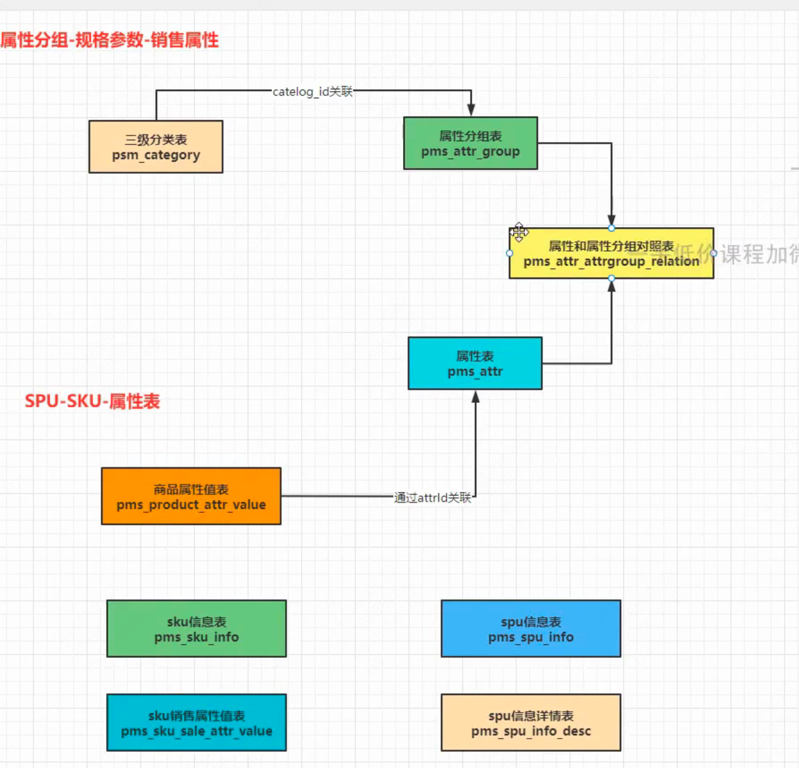

### 3.3 操作菜单批量生成
执行如下sql, 批量生成菜单

```sql
insert  into `sys_menu` (`id`,`pid`,`name`,`url`,`permissions`,`menu_type`,`icon`,`sort`, creator, create_date, update_date) values
(37,1856306257841893378,'平台属性','','',0,'system',0,1067246875800000001,current_timestamp, current_timestamp),
(38,37,'属性分组','mallproduct/attrgroup','',0,'tubiao',0,1067246875800000001,current_timestamp, current_timestamp),
(39,37,'规格参数','mallproduct/baseattr','',0,'log',0,1067246875800000001,current_timestamp, current_timestamp),
(40,37,'销售属性','mallproduct/saleattr','',0,'zonghe',0,1067246875800000001,current_timestamp, current_timestamp),
(41,1856306257841893378,'商品维护','mallproduct/spu','',0,'zonghe',0,1067246875800000001,current_timestamp, current_timestamp),
(42,0,'优惠营销','','',0,'mudedi',0,1067246875800000001,current_timestamp, current_timestamp),
(43,0,'库存系统','','',0,'shouye',0,1067246875800000001,current_timestamp, current_timestamp),
(44,0,'订单系统','','',0,'config',0,1067246875800000001,current_timestamp, current_timestamp),
(45,0,'用户系统','','',0,'admin',0,1067246875800000001,current_timestamp, current_timestamp),
(46,0,'内容管理','','',0,'sousuo',0,1067246875800000001,current_timestamp, current_timestamp),
(47,42,'优惠券管理','coupon/coupon','',0,'zhedie',0,1067246875800000001,current_timestamp, current_timestamp),
(48,42,'发放记录','coupon/history','',0,'sql',0,1067246875800000001,current_timestamp, current_timestamp),
(49,42,'专题活动','coupon/subject','',0,'tixing',0,1067246875800000001,current_timestamp, current_timestamp),
(50,42,'秒杀活动','coupon/seckill','',0,'daohang',0,1067246875800000001,current_timestamp, current_timestamp),
(51,42,'积分维护','coupon/bounds','',0,'geren',0,1067246875800000001,current_timestamp, current_timestamp),
(52,42,'满减折扣','coupon/full','',0,'shoucang',0,1067246875800000001,current_timestamp, current_timestamp),
(53,43,'仓库维护','ware/wareinfo','',0,'shouye',0,1067246875800000001,current_timestamp, current_timestamp),
(54,43,'库存工作单','ware/task','',0,'log',0,1067246875800000001,current_timestamp, current_timestamp),
(55,43,'商品库存','ware/sku','',0,'jiesuo',0,1067246875800000001,current_timestamp, current_timestamp),
(56,44,'订单查询','order/order','',0,'zhedie',0,1067246875800000001,current_timestamp, current_timestamp),
(57,44,'退货单处理','order/return','',0,'shanchu',0,1067246875800000001,current_timestamp, current_timestamp),
(58,44,'等级规则','order/settings','',0,'system',0,1067246875800000001,current_timestamp, current_timestamp),
(59,44,'支付流水查询','order/payment','',0,'job',0,1067246875800000001,current_timestamp, current_timestamp),
(60,44,'退款流水查询','order/refund','',0,'mudedi',0,1067246875800000001,current_timestamp, current_timestamp),
(61,45,'会员列表','member/member','',0,'geren',0,1067246875800000001,current_timestamp, current_timestamp),
(62,45,'会员等级','member/level','',0,'tubiao',0,1067246875800000001,current_timestamp, current_timestamp),
(63,45,'积分变化','member/growth','',0,'bianji',0,1067246875800000001,current_timestamp, current_timestamp),
(64,45,'统计信息','member/statistics','',0,'sql',0,1067246875800000001,current_timestamp, current_timestamp),
(65,46,'首页推荐','content/index','',0,'shouye',0,1067246875800000001,current_timestamp, current_timestamp),
(66,46,'分类热门','content/category','',0,'zhedie',0,1067246875800000001,current_timestamp, current_timestamp),
(67,46,'评论管理','content/comments','',0,'pinglun',0,1067246875800000001,current_timestamp, current_timestamp),
(68,41,'spu管理','mallproduct/spu','',0,'config',0,1067246875800000001,current_timestamp, current_timestamp),
(69,41,'发布商品','mallproduct/spuadd','',0,'bianji',0,1067246875800000001,current_timestamp, current_timestamp),
(70,43,'采购单维护','','',0,'tubiao',0,1067246875800000001,current_timestamp, current_timestamp),
(71,70,'采购需求','ware/purchaseitem','',0,'editor',0,1067246875800000001,current_timestamp, current_timestamp),
(72,70,'采购单','ware/purchase','',0,'menu',0,1067246875800000001,current_timestamp, current_timestamp),
(73,41,'商品管理','mallproduct/manager','',0,'zonghe',0,1067246875800000001,current_timestamp, current_timestamp),
(74,42,'会员价格','coupon/memberprice','',0,'admin',0,1067246875800000001,current_timestamp, current_timestamp),
(75,42,'每日秒杀','coupon/seckillsession','',0,'job',0,1067246875800000001,current_timestamp, current_timestamp);
```

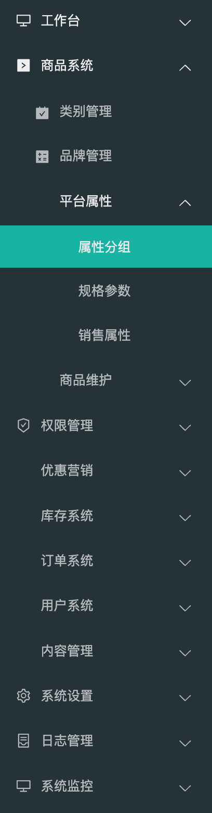

### 3.4 页面布局layout
新建 mallproduct/attrgroup.vue, 并使用element-plus组件 - <el-row>标签 设置页面布局

### 3.5 三级分类组件功能
抽取三级分类页面为一个组件, 使其能在其他页面也被使用

新建categoryComponent.vue 作为三级分类表单组件, 在attrgroup.vue中使用该组件

### 3.6 属性分组-表格展示
开发attrgroup.vue, 对应[属性分组]页面

### 3.7 父子组件传值
将子组件categoryComponent.vue的值(catId)传给父组件, 父组件通过catId进行查询 展示数据

### 3.8 属性分组 - 数据展示
之前我们已经实现了点击三级分类表单的叶子结点时, 子组件(三级分类表单)传值(叶子结点data)给父组件, 接下来父组件就要拿到这个data去查询对应的属性分组数据并展示

新增MybatisPlusInterceptor用于日志打印， 修改AttrGroupController # page 中queryWrapper条件

修改前端页面attrgroup.vue 完成点击三级分类叶子节点时, 该节点的属性分组数据展示

### 3.9 属性分组 - 新增属性分组
修改attrgroup-add-or-update.vue, 完成新增栏的[所属分类id]展示三级分类开发:

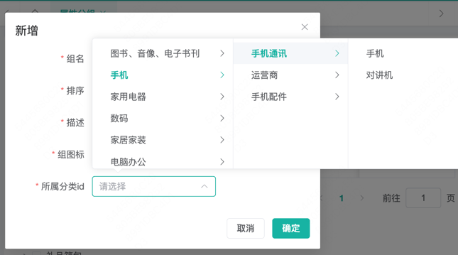

### 3.10 属性分组 - 修改属性分组
JavaScript精度丢失问题: 后端存储的数据是1860581631443451906(long), 返回给前端就是1860581631443452000了

```markdown
您遇到的问题可能是由于 JavaScript 中的数字精度问题导致的。在 JavaScript 中，所有数字都被当作双精度浮点数处理，这可能会导致一些大整数的精度丢失。具体来说，当一个整数超过了 JavaScript 安全整数范围（`Number.MAX_SAFE_INTEGER`，即 `2^53 - 1` 或 `9007199254740991`）时，它就无法被精确地表示。

### 原因分析

1. **JavaScript 的数字精度限制**：
   - JavaScript 使用 IEEE 754 双精度浮点数格式，这意味着它只能安全地表示一定范围内的整数。
   - 超过 `Number.MAX_SAFE_INTEGER` 的整数在 JavaScript 中可能会丢失精度。

2. **后端到前端的数据类型转换**：
   - 如果后端发送的数据是字符串类型，那么前端接收时通常不会有精度问题。
   - 如果后端发送的数据是数字类型，那么在前端接收时可能会因为 JavaScript 的精度限制而出现问题。

### 解决方案

1. **后端发送数据时使用字符串**：
   - 让后端将大整数作为字符串发送，而不是数字。这样可以确保前端接收到的数据是准确的。

2. **前端接收数据时转换为字符串**：
   - 如果后端只能发送数字，那么前端在接收数据后应立即将其转换为字符串，以避免精度问题。

3. **使用第三方库**：
   - 使用如 `BigInt`（在支持的浏览器中）或 `bignumber.js` 等库来处理大整数。

### 示例代码

**后端（假设使用 Java）**：
```java
// 将大整数作为字符串返回
public String getLargeNumberAsString() {
    return String.valueOf(1860581631443451906L);
}
```

**前端**：
```javascript
// 假设从后端接收到的数据是数字类型
axios.get('/some-endpoint').then((response) => {
    const largeNumber = response.data; // 这里可能会丢失精度
    console.log(largeNumber); // 输出可能是错误的值

    // 转换为字符串以保持精度
    const largeNumberStr = largeNumber.toString();
    console.log(largeNumberStr); // 输出正确的值
});
```

或者，如果前端使用 `BigInt`（注意：`BigInt` 需要后端发送的数据以字符串形式，并且浏览器需要支持 `BigInt`）：

```javascript
// 假设从后端接收到的数据是字符串类型
axios.get('/some-endpoint').then((response) => {
    const largeNumberStr = response.data;
    const largeNumberBigInt = BigInt(largeNumberStr);
    console.log(largeNumberBigInt); // 输出正确的 BigInt 值
});
```

总之，解决这个问题的关键是确保在数据传输过程中使用适当的数据类型，以避免 JavaScript 的数字精度限制。

```
```

### 3.11 分页插件
配置MyBatis-plus分页插件, 真正实现分页功能 : MyBatisPlusConfig

> 注意: 不使用分页插件的话, 分页查询不会真的生效

### 3.12 带条件查询

> SpringBoot项目中, 不使用@EnableTransactionManagement注解开启事务 也能使用事务: https://blog.csdn.net/amadeus_liu2/article/details/132296227

> mall_pms.pms_category_brand_relation 商品类别-品牌关联关系表的设计其实不合理, 这里非主属性(brand_name/category_name)部分依赖了主属性(brand_id & category_id) 没有满足数据库表设计的三范式。这会导致更新异常, 例如当品牌表中的brand_name或者品类表中的category_name更新时, pms_category_brand_relation感知不到, 存储的数据就变成了脏数据的问题 <br/>
> 因此我们得通过同步数据(当brand_name或者category_name更新时, 同步更新pms_category_brand_relation表来解决), 并且这个同步必须是原子的, 通过事务来控制

修改:
- BrandController # update (事务已测试 postman->mall-product->BrandController->update-transactional)
- CategoryController # update (事务已测试 postman->mall-product->CategoryController->update-transactional)

## 4. 业务开发 - 规格参数

这一章进行【规格参数】页面的开发

### 4.1 规格参数 - 添加数据
一个属性组应该对应一组规格参数

- 属性组表: pms_attr_group (eg: 主体)
- 规则参数表: pms_attr (eg: 上市日期, 入网型号)
- 属性规则参数关联关系表: pms_attr_attrgroup_relation

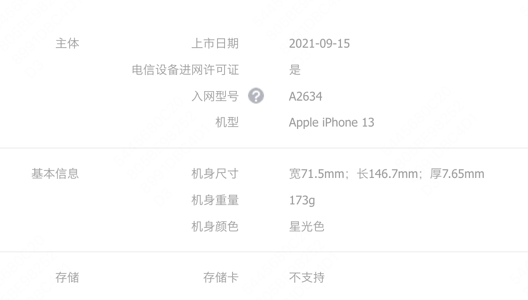

修改 AttrController # add

### 4.2 规格参数 - 查询规格参数
查询规格参数, 查询三级类目对应的规格参数 (一个三级类目对应若干个属性组, 一个属性组对应若干个规格参数)

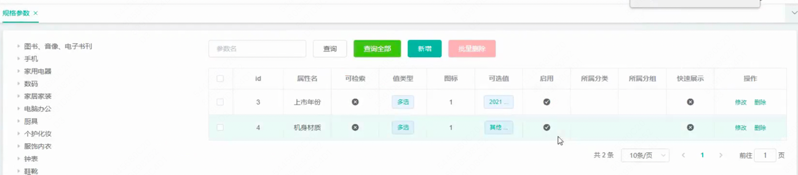

修改 AttrController # page, 使其支持通过catelogId查询对应的规格参数

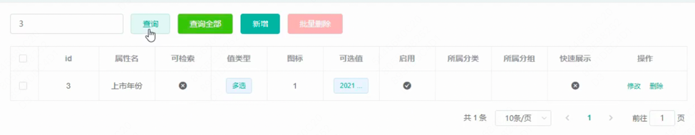

如上图, 现在所属分类 & 所属分组还展示不出来 下节完成

### 4.3 规格参数 - 展示数据优化
通过 pms_attr(规格参数表) 通过 pms_attr_attrgroup_relation (规格参数 - 属性分组关联表) 关联到 pms_attr_group 获得属性分组信息返回给前端展示

级联sql查询数据结果(通过三次点查完成关联查询) 返回给前端, AttrController # page 返回AttrDTO对象

准备测试数据, 测试接口, 测试成功

httpRequest: localhost:9990/mallproduct/attr/page?key=8

```json
{
    "code": 0,
    "msg": "success",
    "data": {
        "total": 1,
        "list": [
            {
                "attrId": 8,
                "attrName": "上市时间",
                "searchType": 0,
                "icon": "aaa",
                "valueSelect": null,
                "attrType": 0,
                "enable": 0,
                "catelogId": 2,
                "showDesc": null,
                "attrGroupName": "主体",
                "catelogName": "手机"
            }
        ]
    }
}
```

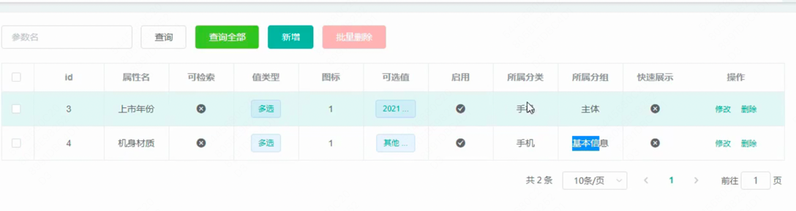

### 4.4 规格参数 - 更新数据

> 思考: 数据库三范式虽然能保证数据的一致性, 但是也导致了查询时需要进行关联查询/多次查询

AttrController # update

级联更新(事务), 更新 pms_attr(规格参数表) 和 pms_attr_attrgroup_relation (规格参数 - 属性分组关联表)

接口测试, 成功

### 4.5 销售属性 - 增删改查业务代码实现
pms_attr(规格参数表) # attr_type (属性类型[0-销售属性，1-基本属性，2-既是销售属性又是基本属性])

销售属性无属性组, 基本属性有属性组

基本属性是指商品的固有属性，这些属性通常不会因为商品的不同规格而变化。 eg: 型号、生产日期等

销售属性是指商品的可变属性，这些属性通常用于区分商品的不同规格或版本。 eg: 颜色、内存等


1. 修改AttrController的page / update接口, 当规格参数的attr_type为销售属性(0)时, 查询/更新都不需要级联操作 pms_attr_attrgroup_relation (规格参数 - 属性分组关联表)
2. 新增ProductConstant, 用于存储商品信息常量
3. 修改AttrController的page / delete接口, 当规格参数的attr_type为基本属性(1)时, 级联删除 pms_attr_attrgroup_relation (规格参数 - 属性分组关联表) 注意@Transactional注解, 测试接口 成功

###  4.6 属性分组和规格参数 - 关联关系展示
功能: 点击【属性分组】的【关联】按钮时, 跳出弹窗展示该属性分组对应的规格参数, 在弹窗内可增删改规格参数

eg: 点击【主体】的关联按钮, 展示 上市时间、入网型号、机型等规格参数

整体思路: 根据属性分组id -> 属性分组-规格参数映射关系表 -> 查询若干个规格参数

1. AttrController中新增attrGroup接口, 接口测试 成功

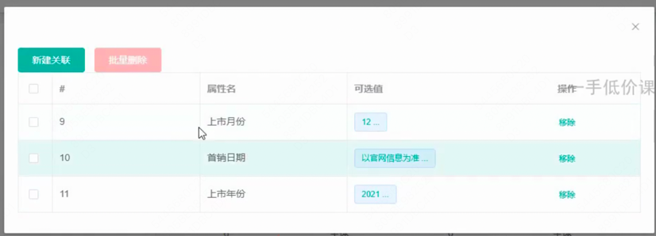

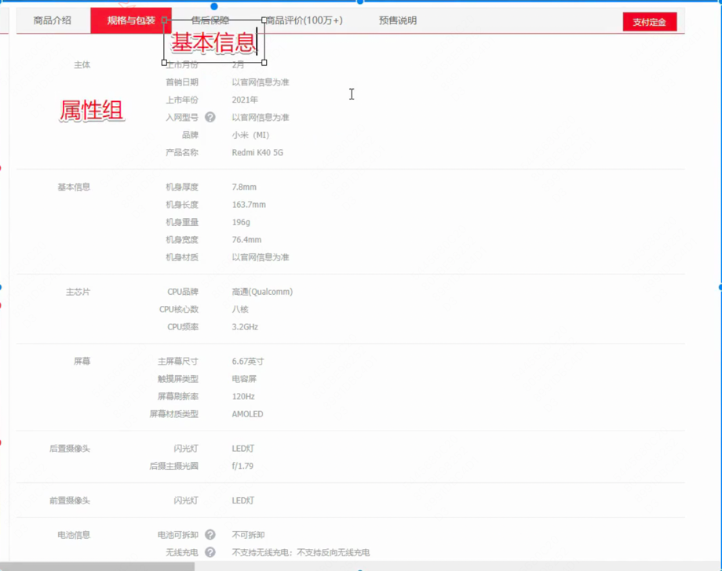

### 4.7 属性分组和规格参数 - 解除关联关系
功能: 如上图, 点击解除关联关系后, 属性分组和规格参数解绑

1. AttrController中新增removeAttrGroupRel接口, 测试接口 成功

一个delete语句删除(注意UpdateWrapper的用法):
```sql
Executing SQL: DELETE FROM pms_attr_attrgroup_relation      WHERE  ((attr_id = ? AND attr_group_id = ?) OR (attr_id = ? AND attr_group_id = ?)) with parameters: {ew=com.baomidou.mybatisplus.core.conditions.update.UpdateWrapper@665f38a9, param1=com.baomidou.mybatisplus.core.conditions.update.UpdateWrapper@665f38a9}
```

### 4.8 属性分组和规格参数 - 查询未关联规格参数
功能:点击[新建关联]为属性分组关联规格参数时, 需要展示当前属性分组未关联规格参数。入参:当前的属性分组attrGroupId, 以及分页参数; 返回当前属性分组attrGroupId未关联的规格参数

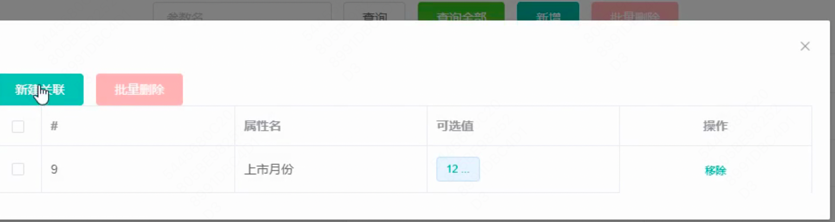

1. AttrController中新增pageNoRelationAttr接口, 测试接口 成功

### 4.9  属性分组和规格参数 - 确认新增属性分组和规格参数关联关系
功能:上一节中实现了展示当前属性分组未关联规格参数后, 这一节就要将对应的关联关系保存下来

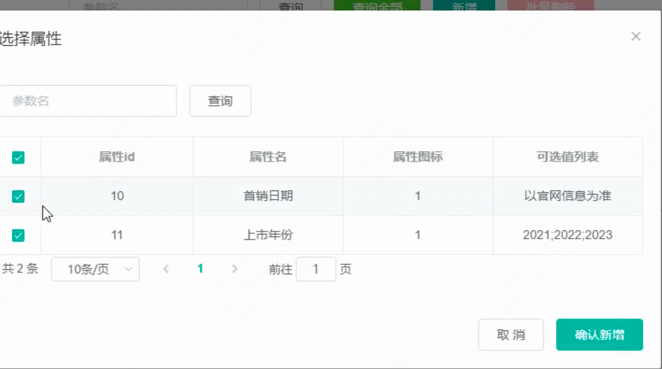

1. AttrAttrgroupRelationController中增加 saveBatch 接口, 测试成功

```xml
    <insert id="insertBatch">
        INSERT INTO pms_attr_attrgroup_relation (attr_id, attr_group_id, attr_sort)
        VALUES
        <foreach collection="list" item="item" separator=",">
            (#{item.attrId}, #{item.attrGroupId}, #{item.attrSort})
        </foreach>
    </insert>
```
## 5. 业务开发 - 商品服务
### 5.1 商品服务 - 新增商品服务和品牌关联
功能: 发布商品, 补充商品相关的品牌/分类/规格参数等信息, 一个三级分类(category)下可能会对应多个品牌(brand), 三级分类-品牌的关联关系表维护在 mall_pms.pms_category_brand_relation

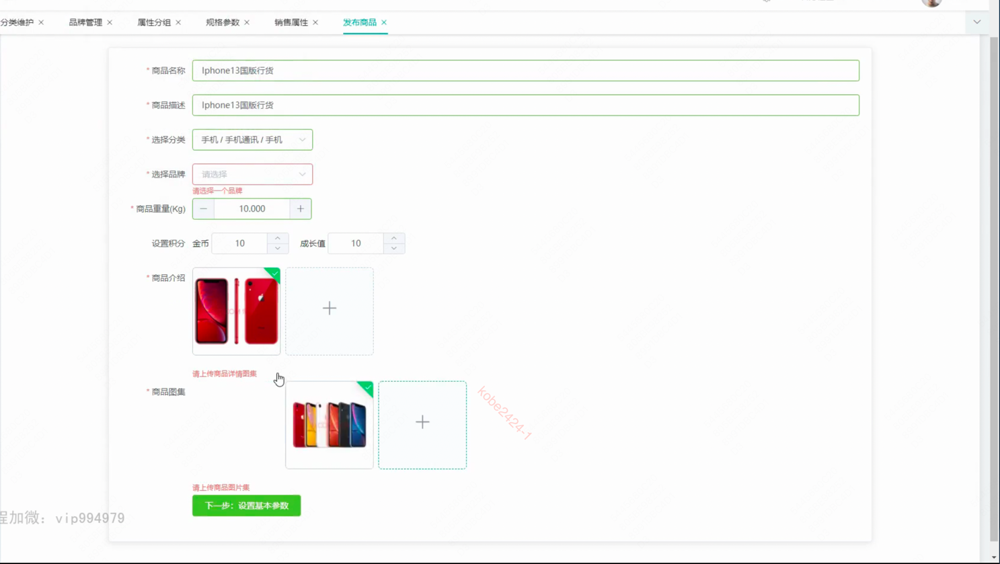

1. BrandController中新增接口findBrandByCatId, 测试成功

> Spring Boot Actuator(致动器) 提供了一组用于监控和管理 Spring Boot 应用程序的功能。在pom.xml中引入 `spring-boot-starter-actuator` 即可使用

### 5.2 商品服务 - 会员模块整合
1. 修改网关的关于mall-member服务的路由信息

```yaml
        # 会员服务路由
        - id: member-route
          uri: lb://mall-member
          predicates:
            - Path=/renren-admin/mallmember/**
          filters:
            - StripPrefix=1 # 去掉路径上的前缀1层 renren-admin
```

### 5.3 商品服务 - 会员等级维护
- 会员信息表: mall_ums.ums_member
- 会员登记表: mall_ums.ums_member_level

### 5.4 商品服务 - 规格参数设置
功能: 根据三级分类ID -> 对应规格参数信息

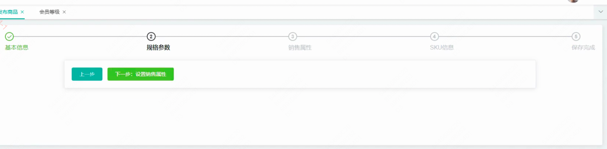

1. AttrController # page 已具备此功能

### 5.5 商品服务 - SPU信息提交
功能: 提交SKU信息, 包括SPU的基本信息, 基本属性, 销售属性等信息。

SpuInfoController # save 可实现

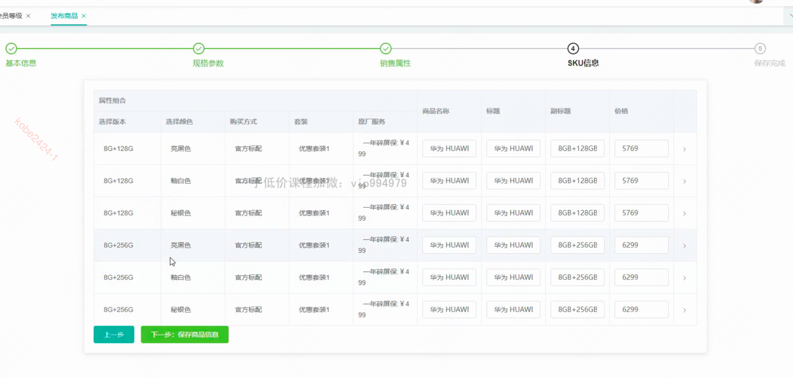

> 在前端提交保存SPU信息时, 如果携带的信息非常多, 比如基本信息、规格参数、图片信息、会员机制等, 仅凭SpuInfoDTO不足以接收所有信息, 我们就可以定义一个SpuDetailInfoDTO接收前端提交的数据, 然后拆解SpuDetailInfoDTO中的内容, `原子性`的存到对应的表中即可

> 增删改查代码都类似 剩下的增删该查部分就快速过了

## 6. 业务开发 - 库存管理
### 6.1 库存管理 - 仓库列表维护
mall_wms.wms_ware_info: 仓库信息表

1. 为仓库服务配置网关路由

```yaml
        # 仓库服务路由
        - id: ware-route
          uri: lb://mall-ware
          predicates:
            - Path=/renren-admin/mallware/**
          filters:
            - StripPrefix=1 # 去掉路径上的前缀1层 renren-admin
```
2. 修改 WareInfoController # page, 使其支持模糊查询, 接口测试 成功

3. 为mall-ware服务添加mybatis-plus分页插件和打印sql拦截器

### 6.2 库存管理 - 商品库存管理
功能: 通过采购单、入库单、退货单等维护商品库存(业务动作的串联后续完成)

mall_wms.wms_ware_sku: 仓库商品库存表

直接修改库存信息: WareSkuController # update

查询仓库的库存信息: WareSkuController # page (修改其底层queryWrapper条件)

### 6.3 库存管理 - 创建采购需求
功能: 创建采购需求 -> 生成采购单 -> 完成采购, 修改采购需求(回填采购单号, 修改采购需求状态) -> 修改库存

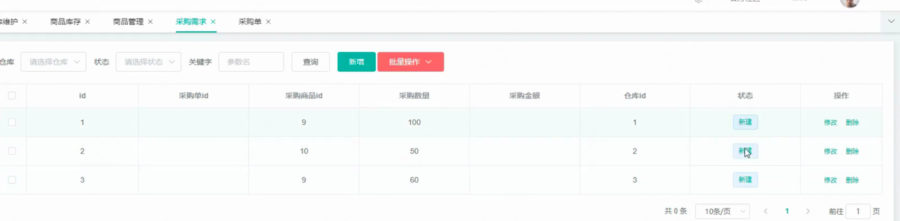

mall_wms.wms_purchase_detail: 采购需求明细表

1. 修改 PurchaseDetailController # page 中获得queryWrapper的逻辑, 使其支持根据采购单ID, skuId, sku名称, 仓库ID进行查询

> Consumer: 函数式接口 @FunctionInterface (接受一个参数, 没有返回值), queryWrapper中的and/or等方法的入参就是他。只有具有一个抽象方法的接口才能作为函数式接口, 被lambda表达式简化使用

### 6.4 库存管理 - 采购需求合并
一个采购需求只是一种商品的采购需求, 但一个采购单却可能是多个商品的采购单, 因此需要对既存的采购需求进行合并, 生成一个采购单

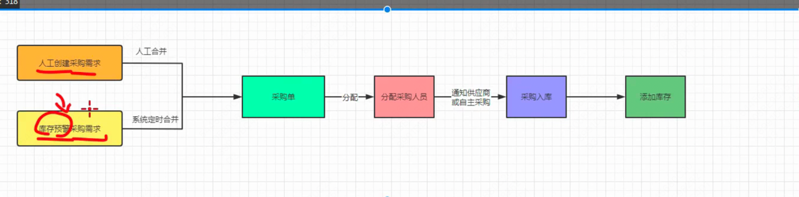

人工合并采购需求到某个采购单:

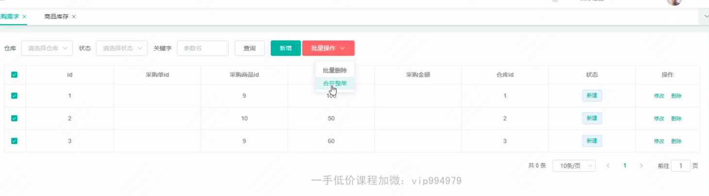

功能: 获取所有状态为新建/已分配的采购单, 供合并采购需求弹窗时, 选择将采购需求合并到哪个采购单

1. PurchaseController新增pageNewWareOrder方法, 用于根据指定的采购单条件查询满足提交的采购单们, 测试成功

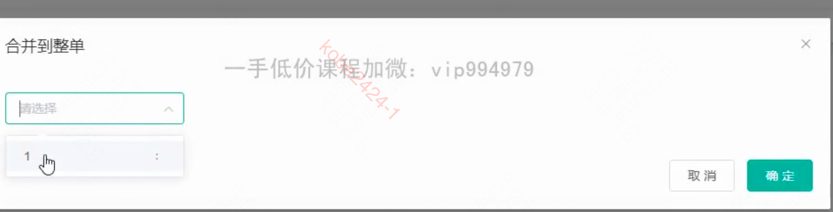

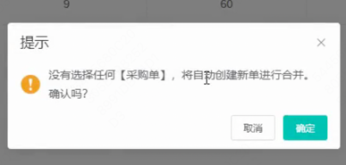

功能: 如上图, 点击确定后, 要么将批量选择的采购需求合并到某个指定的采购单中, 如果用户未选采购单, 则新建一个采购单, 并将批量选择的采购需求合并到该采购单中

...

## 7. 全文检索引擎 - ES
### 7.1 全文检索引擎 - ElasticSearch介绍
ElasticSearch是一个开源的高扩展的分布式全文搜索引擎, 是整个ELK技术栈的核心。它可以近乎实时的存储、检索数据; 扩展性好, 可以扩展到上百台服务器, 处理PB级别的数据。

ElasticSearch是对Lucene的封装, 提供了RESTful API, 简化了操作, 提高了效率。

##### ElasticSearch用途
1. 搜索的数据对象是大量的非结构化的文本数据
2. 文本记录达到数十万或数百万个甚至更多
3. 支持大量基于交互式文本的查询
4. 需求非常灵活的全文搜索查询
5. 对高度相关的搜索结果有需求, 但是没有可用的关系型数据库可以满足

> ES中的索引约等于数据库中的database, 索引中的type约等于数据库中的table, 索引中的document约等于数据库中的row

##### 索引
ES的索引(indices)在这里不要和mysql数据库中的索引混淆, es中的索引和mysql中的database的概念是一致的

##### 类型
类型(type)对应的是数据库中的table

##### 文档
文档(document)对应的是数据库中的row

##### 字段
字段(field)对应的是数据库中的column

##### 倒排索引


## 2. 基础业务
## 3. 商城业务


# 五、上线部署
## 1. K8S
## 2. Kubesphere
## 3. 集群部署

