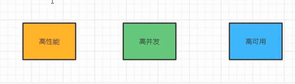

# 分布式三高商城系统
# 一、系统架构演变
### 1. 服务架构的演变
##### 1.1 单体架构
单体架构中使用经典的三层模型:表现层、业务逻辑层、数据访问层，所有模块都耦合在一起。

简单，高效，开发速度快，缺点是性能容易遇到瓶颈，扩展性差。


##### 1.2 单体架构-集群
将单体项目部署在多台服务器上, 使用nginx做负载均衡, 提高系统的并发处理能力。

缺点是维护成本高， 扩展性差， 难以进行水平扩展。


##### 1.3 垂直化
将单体项目按照业务进行拆分, 每个业务模块使用独立的服务器, 实现业务模块的解耦和独立部署。比如将一个商城系统拆分成订单系统、用户系统和商品系统

缺点是冗余代码多, 用户系统和商品系统中可能都有对商品的crud操作


##### 1.4 服务化
SOA(面向服务的架构), 将业务模块再拆分成更小的服务, 每个服务都提供特定的功能, 实现业务模块的解耦和独立部署。

ESB: 企业服务总线, 用于连接不同的服务, 实现服务之间的通信和集成。


##### 1.5 微服务化
在SOA的基础上继续演进就是我们讲的微服务了, SOA的服务进行更细粒度的拆分就是微服务。

随着服务拆分之后, 微服务架构下的 服务的注册、服务之间的发现、服务之间的调用、服务的治理等都需要做相应的处理。

并且对基础运维的能力要求会越来越高, 虚拟化、容器化等。


**微服务和SOA的区别:**
1. 思想上: 微服务的目的是解耦, 而SOA的目的是实现数据的互通和共享性。
2. 协议: 微服务会使用一些轻量级的通信协议(Restful API)
3. 基础设施要求: 微服务更加强调开发运维的持续交付(CICD)

# 二、项目介绍
### 1.三高介绍
三高指的是: 高性能(响应快)、高并发(并发能力强)、高可用(某个节点/服务宕机后, 整个应用的容灾能力还是强的)



### 2.项目架构
##### 2.1 项目架构图:


##### 2.2 业务组成:


##### 2.3 RPC框架

在微服务架构中，服务与服务之间要实现接口的调用我们肯定要通过相关的RPC(Remote Procedure Call)框架来实现。

常用的RPC框架有:Dubbo,Google的GRPC，Apache的Thrift，微博的Motan，京东的EasyRPC等。我们通过RPC框架可以取调用服务提供者提供的服务，但有一个前提是我们要能找到这个服务。通常我们的服务部署都是集群多节点的部署，所以在消费者这端就不可能直接写死在代码里面，这时就涉及到了服务的发现问题，这时就需要另一个组件注册中心了


#####  2.4 注册中心

注册中心实现服务地址管理的功能，解决服务动态感知(上线，下线)。


#####  2.5 负载均衡

在服务注册中心的介绍中我们可以看到负载均衡的应用。我们可以通过Ribbon来实现客户端的负载均衡，负载均衡的策略可以是：轮询，随机，根据响应时间来计算权重的轮询等。


#####  2.6 配置中心

在微服务架构中我们有很多个服务，而每个服务中是都会有单独的配置文件的。里面有很多的配置信息的有关联的，而且对于后期的更新维护也会非常的不方便，这时配置中心就上场了。常用的配置中心有：apollo/Nacos/disconf/zookeeper/diamond/Spring Cloud Config


#####  2.7 网关

网关可以帮助我们完成用户请求的入口，路由。完成统一授权，日志的记录，权限的认证和限流及熔断操作。


#####  2.8 限流、降级、缓存

在现实的微服务架构中的性能是很难满足所有的用户请求，这时我们就可以通过一些措施来保证我们的核心服务的正常运转。

限流：sentinel、hystrix

降级：主动降级(订单评论、广告关闭)、被动降级

缓存：降低数据源访问频率、Redis等

容错机制：服务出现挂机，宕机之后的处理机制。


##### 2.9 Bus

Bus消息总线，实现异步化的通信机制。


##### 2.10 链路监控

因为微服务中的服务实在是太多了，为了能更好的监控个服务的情况，肯定就需要链路监控服务，我们可以通过sleuth+zipkin来实现，应用层监控，系统级监控


# 三、环境准备
##### 3.1 虚拟机准备
这里我们准备的是阿里云服务器: https://swasnext.console.aliyun.com/servers/cn-beijing

##### 3.2 Docker安装
CentOS7安装Docker: https://docs.docker.com/engine/install/centos/

1. 卸载原有环境
```shell
sudo yum remove docker \ 
                  docker-client \ 
                  docker-client-latest \ 
                  docker-common \ 
                  docker-latest \ 
                  docker-latest-logrotate \ 
                  docker-logrotate \ 
                  docker-engine
```

2. 安装依赖环境和镜像地址
```shell
sudo yum install -y yum-utils
```

设置官方镜像地址
```shell
sudo yum-config-manager \
    --add-repo \
    https://download.docker.com/linux/centos/docker-ce.repo
```

设置阿里云镜像地址
```shell
sudo yum-config-manager \
    --add-repo \
    http://mirrors.aliyun.com/docker-ce/linux/centos/docker-ce.repo
```

安装docker CE
```shell
sudo yum install -y docker-ce docker-ce-cli containerd.io
```

启动docker
```shell
systemctl start docker
```

查询docker中正在运行的容器信息
```shell
# docker ps命令用于列出当前正在运行的Docker容器。它会显示容器的ID、名称、状态、端口映射等信息
docker ps

# CONTAINER ID   IMAGE     COMMAND   CREATED   STATUS    PORTS     NAMES
```

查询docker中所有容器信息, 不管有没有在运行
```shell
docker ps -a
```

删除docker容器
```shell
docker rm 容器ID
```

查看docker版本
```shell
docker version
```

设置docker服务开机自动启动
```shell
systemctl enable docker
```

##### 3.3 Docker中安装mysql数据库
为了后续做CICD, 我们在docker中安装必要软件

拉取mysql5.7镜像
```shell
docker pull mysql:5.7
```
> 因为docker国内被墙了, 所以我们需要使用国内的镜像仓库, 配置方法参考: https://blog.csdn.net/Lichen0196/article/details/137355517 <br/>
> 但是这个blog中给出的镜像数据源也不太行, 镜像数据源可以使用:

```json
{
  "registry-mirrors": [
    "https://docker.fxxk.dedyn.io",
    "https://docker.m.daocloud.io",
    "https://docker.1panel.live"
  ]
}
```

查看docker镜像信息
```shell
docker images

# REPOSITORY   TAG       IMAGE ID       CREATED         SIZE
# mysql        5.7       5107333e08a8   11 months ago   501MB
```

基于mysql5.7镜像启动容器:
```shell
# 基于mysql5.7镜像启动容器, 容器中端口为3306(第二个), 宿主机端口也为3306(第一个), 容器名称为mysql, -v 数据挂载信息(容器中哪些目录下的信息挂载到宿主机的哪些目录下) -e: 设置root账号的默认密码为root
docker run -p 3306:3306 --name mysql -v /mydata/mysql/log:/var/log/mysql -v /mydata/mysql/data:/var/lib/mysql -v /mydata/mysql/conf:/etc/mysql/conf.d -e MYSQL_ROOT_PASSWORD=199741Zy1! -d mysql:5.7
```

> 怎么修改mysql密码: https://blog.csdn.net/m0_37482190/article/details/133250569 (记一次狗黑客攻击)

docker启动mysql容器时, 发生了问题 容器一启动就挂, 可以通过以下命令查看容器日志
```shell
docker logs <container_id>
```

docker启动mysql容器立马挂掉, 通过日志看是不能读取'/etc/mysql/conf.d/目录的解决方法: https://www.cnblogs.com/wxxf/p/17854020.html

再次执行docker ps命令后, 确认mysql容器已经启动
```shell
[root@iZ2ze9afrj51kl498kmdwkZ ~]# docker ps
CONTAINER ID   IMAGE       COMMAND                  CREATED          STATUS          PORTS                               NAMES
2b138bd7cdd3   mysql:5.7   "docker-entrypoint.s…"   41 minutes ago   Up 41 minutes   0.0.0.0:3306->3306/tcp, 33060/tcp   mysql
```

在宿主机的/mydata/mysql/conf目录下设置配置文件my.cnf:
```xml
[client]
default-character-set=utf8

[mysql]
default-character-set=utf8

[mysqld]
init_connect="SET collation_connection = utf8_unicode_ci"
init_connect="SET NAMES utf8"
character-set-server=utf8
collation-server=utf8_unicode_ci
skip-character-set-client-handshake
skip-name-resolve
```
重启docker-mysql容器:
```shell
docker restart <container_id>

[root@iZ2ze9afrj51kl498kmdwkZ conf]# docker ps
CONTAINER ID   IMAGE       COMMAND                  CREATED       STATUS       PORTS                               NAMES
2b138bd7cdd3   mysql:5.7   "docker-entrypoint.s…"   4 hours ago   Up 4 hours   0.0.0.0:3306->3306/tcp, 33060/tcp   mysql
[root@iZ2ze9afrj51kl498kmdwkZ conf]# docker restart 2b
2b
```
连接数据库(root:root)

##### 3.4 Docker中安装Redis
拉取Redis最新版本镜像
```shell
docker pull redis
```

根据Redis镜像文件创建容器
```shell
# -d:后台运行 -p:端口映射 -v:数据挂载 --name:容器名称
docker run -d -p 6379:6379 --name mall-redis -v /mydata/redis/data:/data -v /mydata/redis/conf:/etc/redis  redis redis-server /etc/redis/redis.conf
```
因为配置了目录挂载, 所以如果报错 `Fatal error, can't open config file '/etc/redis/redis.conf': No such file or directory`, 我们在/mydata/redis/conf下创建redis.conf文件即可

重新启动容器即可:
```shell
[root@iZ2ze9afrj51kl498kmdwkZ conf]# docker ps
CONTAINER ID   IMAGE       COMMAND                  CREATED         STATUS          PORTS                               NAMES
83bffad12ab5   redis       "docker-entrypoint.s…"   2 seconds ago   Up 1 second     0.0.0.0:6379->6379/tcp              mall-redis
2b138bd7cdd3   mysql:5.7   "docker-entrypoint.s…"   5 hours ago     Up 11 minutes   0.0.0.0:3306->3306/tcp, 33060/tcp   mysql
```

进入redis容器内部:
```shell
docker exec -it <container_id> /bin/bash
```

在redis容器内部尝试连接redis:
```shell
root@83bffad12ab5:/data# redis-cli
127.0.0.1:6379> set name zhangsan
OK
127.0.0.1:6379> get zhangsan
(nil)
127.0.0.1:6379> get name
"zhangsan"
```

设置mysql容器和redis容器开机自启动:
```shell
docker update --restart=always <container_id>
```

重要: 修改/mydata/redis/conf/redis.conf文件中的bind 127.0.0.1为bind 0.0.0.0(从只允许本机访问改成允许所有ip访问), 修改protected-mode为no。参考 https://developer.aliyun.com/article/792302

idea连接redis, ok

##### 3.5 本地开发环境准备
1. jdk 1.8
2. idea + web storm
3. git

##### 3.6 父工程创建
mall_zy(pom项目, 做版本控制用)

##### 3.7 相关微服务模块创建
- 商品 mall-product
- 订单 mall-order
- 会员 mall-member
- 库存 mall-ware
- 优惠活动 mall-coupon

> 解决git将子模块误认为子系统模块的问题(github文件夹有向右的白色箭头且不能打开): https://www.jianshu.com/p/28e61a24d847

##### 3.8 gitignore文件配置

##### 3.9 数据库表创建
- mall_pms 商品数据库
- mall_oms 订单数据库
- mall_ums 会员数据库
- mall_wms 库存数据库
- mall_sms 优惠活动数据库

执行./sql/下对应数据库的.sql文件, 在对应数据库下创建表

##### 3.10 服务创建和数据库配置
前端: Vue + ElementUI <br/>
后端: SpringBoot + MyBatisPlus

我们在本项目中使用人人开源中提供的模版项目来实现快速的项目构建: https://github.com/renrenio  https://gitee.com/renrenio

使用到的模版项目有:
- renren-fast: 后端模版
- renren-generator: 代码生成器
- renren-fast-vue: 前端模版

1. renren-fast: <br/>
修改renren-fast中application.yml配置文件, 创建对应的数据库 renren_fast

根据renren-fast/db/下的.sql文件创建数据库表

##### 3.11 后端服务启动配置
启动renren-fast服务, 启动类: RenrenApplication

##### 3.12 前端服务搭建
前端服务: renren-fast-vue

安装node.js

启动renren-fast-vue参考: https://github.com/renrenio/renren-fast-vue/wiki/Getting-started

> ps: 这个前端中用到的依赖 如node-sass等不支持mac的arm64架构, 前端项目放弃了

##### 3.13 generator系统搭建
使用renren-generator生成代码(通过模版文件生成)

修改renren-generator的application.yml, generator.properties配置文件, 生成我们各个数据库下的模版代码

启动renren-generator, 访问localhost:9999, 生成对应数据库的非业务crud代码

##### 3.14 common模块搭建
mall-common模块中存放一些公共的代码, 比如异常处理类, 工具类等

对renren-generator生成的代码修改导入的依赖, 修改报错的代码, 使项目能够正常启动

##### 3.15 mybatis-plus整合
添加mybatis-plus依赖, mysql数据库依赖
```xml
<!--mybatis-plus-->
<dependency>
    <groupId>com.baomidou</groupId>
    <artifactId>mybatis-plus-boot-starter</artifactId>
    <version>3.5.2</version>
    <scope>compile</scope>
</dependency>
<!--mysql-->
<dependency>
    <groupId>mysql</groupId>
    <artifactId>mysql-connector-java</artifactId>
    <version>8.0.11</version>
</dependency>
```

完成mybatis-plus的配置, mall-product: application.yaml

配置完成后在MallProductApplicationTests中测试成功

##### 3.16 各微服务代码生成
为mall_oms(9991), mall_pms(9990), mall_sms(9992), mall_ums(9993), mall_wms(9994)分别生成代码

##### 3.17 SpringCloud Netflix介绍


前端不要直接调用后端, 要经过nginx -> 网关

netflix已经不再维护了, 也没有springcloud alibaba好用, 不推荐使用

##### 3.18 SpringCloud Alibaba介绍
注意: springboot和spring cloud alibaba的版本要对应, 否则可能会有问题(官网有版本对应), 这里我们使用的是springboot 2.4.12, spring cloud alibaba 2021.1

我们会使用到的微服务组件:
- 注册中心: Nacos
- 配置中心: Nacos
- 负载均衡: Ribbon
- 声明式服务调用: OpenFeign
- 服务容错: Sentinel
- 网关: Gateway
- 链路监控: Sleuth
- 分布式事务: Seata
- 消息队列: RabbitMQ

##### 3.19 下载nacos服务
本机的nacos放在了/opt/nacos

linux/unix/mac下单机启动naocs服务(是一个springboot服务):
```shell
sh startup.sh -m standalone
```
服务启动之后访问localhost:8848/nacos即可


##### 3.20 nacos 微服务注册
1. 修改pom.xml文件 添加nacos依赖
```xml
<!--nacos服务注册-->
<dependency>
    <groupId>com.alibaba.cloud</groupId>
    <artifactId>spring-cloud-starter-alibaba-nacos-discovery</artifactId>
</dependency> 
```

2. 启动类上加 @EnableDiscoveryClient 注解

3. 修改application.yml文件, 添加nacos配置
```yaml
spring:
  cloud:
    nacos:
      discovery:
        server-addr: localhost:8848 
```

注意, 我们还需要导入spring-cloud-starter-bootstrap依赖, 否则报错ClassNotFoundException
```xml
  <dependencies>
    <dependency>
      <groupId>org.springframework.cloud</groupId>
      <artifactId>spring-cloud-starter-bootstrap</artifactId>
      <version>3.0.3</version>
    </dependency>
  </dependencies>
```
完成其他微服务模块的注册中心配置(1.pom.xml 2.启动类 3.application.yaml)

##### 3.21 Doker容器中安装
在docker中安装nacos

拉取nacos镜像文件
```shell
docker pull nacos/nacos-server:latest
```

> 这里我们nacos的版本是2.4.3

启动nacos容器:
```shell
# -d 后台运行模式 -e 设置环境变量 -v 设置挂载目录 --name 设置容器名称 -p 设置端口映射 nacos/nacos-server:1.4.2 镜像名称
docker run -d -e MODE=standalone -v /mydata/nacos/conf:/home/nacos/conf --name nacos -p 8848:8848 -p 8849:8849 -p 9848:9848 -p 9849:9849 nacos/nacos-server:latest
```

然后需要:
1. 在/mydata/nacos/conf下新增配置文件
2. 修改nacos的数据源为mysql
3. 修改nacos的账号密码, 参考: https://nacos.io/docs/latest/manual/admin/auth/
```shell
(base) zhaoyu@MBP-W12T7NRJFQ-1817 ~ % curl -X POST '8.152.0.119:8848/nacos/v1/auth/users/admin' -d 'password=nacos' 
{"username":"nacos","password":"nacos"}
```
4. 配置nacos开机启动
```shell
docker update --restart=always nacos
```
5. 修改我们微服务模块的nacos配置

```yaml
spring:
  cloud:
    nacos:
      discovery:
        server-addr: 8.152.0.119:8848
        username: nacos
        password: nacos
```
##### 3.22 OpenFeign服务调用
OpenFeign是一个声明式的服务调用组件, 本质上是封装了Ribbon和RestTemplate, 实现了负载均衡和Rest调用, 我们用它来实现服务间的调用

1. 在服务提供者模块中定义服务提供接口
2. 在服务消费者中调用服务提供者的服务

我们用 mall-order(服务调用者) 和 mall-product(服务提供者) 来做服务调用测试

1. mall-product -> BrandController (服务提供者):
```java
    //OpenFeign服务提供接口
    @GetMapping("/all")
    public R queryAllBrand(){
        BrandEntity brandEntity = new BrandEntity();
        brandEntity.setName("huawei");
        brandEntity.setBrandId(100L);
        return R.ok().put("brands", brandEntity);
    }
```
2. mall-order (服务调用)
- 引入相关的依赖
```xml
<!--openfeign-->
<dependency>
    <groupId>org.springframework.cloud</groupId>
    <artifactId>spring-cloud-starter-openfeign</artifactId>
</dependency>
<!--load balancer组件 openfeign调用者必备-->
<dependency>
    <groupId>org.springframework.cloud</groupId>
    <artifactId>spring-cloud-starter-loadbalancer</artifactId>
    <version>3.1.0</version>
</dependency>
```
- 创建对应的Feign接口: ProductOpenFeignService
```java
@FeignClient(name="mall-product") // 说明要调用的服务名称
public interface ProductOpenFeignService {

    //需要访问的远程方法
    @GetMapping("mallproduct/brand/all")
    public R queryAllBrand();
}
```
- 启动类新增@EnableFeignClients注解， 开启远程调用功能
```java
@SpringBootApplication
@MapperScan("com.zy.mallorder.dao")
@EnableDiscoveryClient
@EnableFeignClients(basePackages = "com.zy.mallorder.feign")
public class MallOrderApplication {

    public static void main(String[] args) {
        SpringApplication.run(MallOrderApplication.class, args);
    }

}
```
3. 测试 访问localhost:9991/malloms/order/feign
```java
@RestController
@RequestMapping("malloms/order")
public class OrderController {
    @Autowired
    private OrderService orderService;

    @Autowired
    private ProductOpenFeignService productOpenFeignService;

    //测试openFeign服务调用
    @GetMapping("feign")
    public R testFeign() {
        return productOpenFeignService.queryAllBrand();
    }
}
```

**测试:** 
0. 启动mall-product和mall-order服务
1. mall-product和mall-order都注册到了nacos
2. 访问 http://localhost:9991/malloms/order/feign, 成功返回结果

##### 3.23 Nacos配置中心基本使用
在mall-order测试nacos配置中心使用

1. 引入nacos-config依赖
```xml
<!--nacos配置中心-->
<dependency>
    <groupId>com.alibaba.cloud</groupId>
    <artifactId>spring-cloud-starter-alibaba-nacos-config</artifactId>
    <version>2021.1</version>
</dependency>
```

2. 创建bootstrap.yaml文件, 添加nacos配置中心配置(bootstrap加载顺序优先于application)
```yaml
server:
  port: 9991

spring:
  application:
    name: mall-order
  cloud:
    # ncaos配置
    nacos:
      discovery:
        server-addr: 8.152.0.119:8848 # Nacos服务注册中心地址
      config:
        server-addr: 8.152.0.119:8848 # Nacos配置中心地址
        file-extension: yaml # 指定加载yaml后缀的配置文件
        group: DEFAULT_GROUP # 指定服务所在的分组 TEST_GROUP or DEV_GROUP
        # namespace: 70f309cd-313e-47ab-85ed-23e713b79a31 # 指定服务在哪个命名空间下面
```

3. 添加@RefreshScope注解打开配置信息动态刷新功能
```java
@RestController
@RequestMapping("malloms/order")
@RefreshScope
public class OrderController {
    @Value("${username}")
    private String username;

    @Value("${password}")
    private String password;

    //测试nacos配置中心
    @GetMapping("/config")
    public R queryConfig() {
        return R.ok().put("username", username).put("password", password);
    }
}
```

4. 在nacos控制台中添加配置文件, 发布配置文件 (ps:配置中心中的配置信息优先于application.yaml中的配置信息)


5. 测试: 启动mall-order服务 访问 localhost:9991/malloms/order/config, 成功返回 `{"msg":"success","password":"123456","code":0,"username":"zhaoyu93"}`

6. 为其他微服务新增bootstrap配置文件

##### 3.24 命名空间和配置组
可以通过dataId、group、namespace 三种方式进行配置文件隔离

为每个微服务创建一个配置命名空间


然后通过配置分组来区分 dev, test, prod环境

##### 3.25 配置拆分
我们现在是将某个服务中的所有配置都写在了同一个配置文件中, 这样会导致配置文件过大, 难以维护, 配置拆分后, 配置文件就变小了, 也方便维护了

mybatis相关配置:


datasource相关配置:


bootstrap.yaml配置:

```yaml
server:
  port: 9991

spring:
  application:
    name: mall-order
  cloud:
    # ncaos配置
    nacos:
      discovery:
        server-addr: 8.152.0.119:8848 # Nacos服务注册中心地址
      config:
        server-addr: 8.152.0.119:8848 # Nacos配置中心地址
        file-extension: yaml # 指定加载yaml后缀的配置文件
        group: DEFAULT_GROUP # 指定服务所在的分组 eg: TEST_GROUP or DEV_GROUP
        namespace: 56f80f04-c3b2-440a-a28b-4cb24426fd83 # 指定服务在哪个命名空间下面
        ext-config[0]:date-id: mall-order-mybatis # 指定多个配置文件
        ext-config[0].group: test
        ext-config[0]:refresh: false

        ext-config[1]:date-id: mall-order-datasource # 指定多个配置文件
        ext-config[1].group: test
        ext-config[1]:refresh: false
```
##### 3.26 Gateway核心概念介绍
客户端不可能记下每一个微服务的地址, 因此我们需要网关来路由, 此外网关还可以实现限流、鉴权、统一日志记录等功能

Spring Cloud Gateway 最重要的三个概念:
- 路由(route): 路由是网关最基础的部分, 路由信息包括ID、目标URI、匹配条件、过滤器信息等
- 断言(predicate): 路由条件, 例如请求方法、请求路径等
- 过滤器(filter): 过滤器用于修改请求和响应的信息


> spring cloud gateway 为我们提供了一些现成的predicates(断言)和filters(过滤器)
> 请求到网关 -> 断言 -> 过滤器 -> 路由到对应微服务 -> 过滤器 -> 返回结果


示例配置文件:
```yaml
server:
  port: 9999

spring:
  main:
    web-application-type: reactive
  application:
    name: cloud-gateway-service
  cloud:
    nacos:
      discovery:
        server-addr: localhost:8848
    gateway:
      discovery:
        locator:
          enabled: true # 开启注册中心路由功能, 把网关服务注册到naocs中
      routes:
        # 路由1
        - id: nacos-provider
          uri: http://localhost:9001/nacos-provider # 匹配提供服务的路由地址
          predicates:
            - Path=/gateway/** # 断言, 路径相匹配则进行路由, 访问http://localhost:9001/nacos-provider/gateway/** 时匹配
        # 路由2
        - id: nacos-provider2
          uri: http://localhost:9001/nacos-provider # 匹配提供服务的路由地址
          predicates:
            - Path=/route/** # 断言, 路径相匹配则进行路由
```

##### 3.27 Gateway网关服务搭建
创建网关服务模块 mall-gateway(9995)

1. pom.xml中添加对应的依赖:
```xml
        <!--nacos服务注册-->
        <dependency>
            <groupId>com.alibaba.cloud</groupId>
            <artifactId>spring-cloud-starter-alibaba-nacos-discovery</artifactId>
        </dependency>
        <!--gateway依赖-->
        <dependency>
            <groupId>org.springframework.cloud</groupId>
            <artifactId>spring-cloud-starter-gateway</artifactId>
            <version>${spring-cloud-gateway.version}</version>
        </dependency>
        <!--loadbalancer负载均衡组件, 必须加 否则gateway无法实现负载均衡-->
        <dependency>
            <groupId>org.springframework.cloud</groupId>
            <artifactId>spring-cloud-starter-loadbalancer</artifactId>
            <version>3.0.1</version>
        </dependency>
```
2. 完成配置
bootstrap.yaml:

```yaml
server:
  port: 9995

spring:
  application:
    name: mall-gateway
  cloud:
    # ncaos配置
    nacos:
      discovery:
        server-addr: 8.152.0.119:8848 # Nacos服务注册中心地址
      config:
        server-addr: 8.152.0.119:8848 # Nacos配置中心地址
        file-extension: yaml # 指定加载yaml后缀的配置文件
        group: DEFAULT_GROUP # 指定服务所在的分组 eg: TEST_GROUP or DEV_GROUP
        # namespace: 56f80f04-c3b2-440a-a28b-4cb24426fd83 # 指定服务在哪个命名空间下面
        #        ext-config[0]:date-id: mall-order-mybatis # 指定多个配置文件
        #        ext-config[0].group: test
        #        ext-config[0]:refresh: false
        #
        #        ext-config[1]:date-id: mall-order-datasource # 指定多个配置文件
        #        ext-config[1].group: test
        #        ext-config[1]:refresh: false

    # 配置路由
    gateway:
      routes:
        # 如果请求的url中包含baidu，则路由到百度
        - id: route1
          uri: http://www.baidu.com
          predicates:
            - Query=url,baidu
        # 如果请求的url中包含taobao，则路由到淘宝
        - id: route2
          uri: http://www.taobao.com
          predicates:
            - Query=url,taobao


```

3. 启动mall-gateway服务 测试网关服务路由规则
- 网关服务成功注册到了nacos
- 访问 localhost:9995/?url=baidu, 成功路由到百度; 访问 localhost:9995/?url=taobao, 成功路由到淘宝

# 四、业务开发
前端模版服务: renren-ui (需要使用node v16.0.0 -> nvm use 16.0.0 否则报错)

后端模版服务: renren-security

### 0.1 业务开发方向拆解
1. 维护基础数据 - 商品分类、商品品牌、商品规格、商品属性、商品SPU、商品SKU

基于renren-security模版和renren-ui模版开发

## 1. 后台管理系统

## 1. 三级类目操作

### 1.1 商品分类后台查询
执行pms_category.sql 初始化商品分类数据

> 接口测试记录参考postman

mall-product -> CategoryController
- 新增listTree接口, postman测试接口 通过

> compareTo方法升降序是如何确定的: https://blog.csdn.net/weixin_45505313/article/details/130705913

### 1.2 菜单维护
1. 在renren-ui前端页面上新增【商品系统】一级菜单
2. 在【商品系统】下新增【类别管理】菜单, 路由填写 mallproduct/category。ps: 菜单信息维护在renren-security的sys_menu表中
3. 修改renren-ui, 新增mall/product/category.vue页面, 确保页面能够正确跳转, 页面内容参考renren-ui


### 1.3 数据展示 & renren-security 服务注册
vue + element ui 实现数据展示

element ui 组件: https://element.eleme.cn/#/zh-CN/component/installation

模版服务中, 前端默认请求的url是人人模版后端: http://localhost:9998/renren-admin

但是现在我们的服务架构如下图:


因此需要引入网关服务(mall-gateway 9995), 前端只请求网关服务, 网关服务完成后续服务的路由 (修改renren-ui的.env文件)

修改renren-ui的.env文件, 将后端请求地址改为网关服务

接下来我们需要让renren-security注册到nacos中, 这样网关才能将其路由到。

##### renren-security服务注册
1. renren-security使用的是较高版本的springboot 3.2.6, 因此我们要用spring cloud alibaba 2023.x 来与其兼容
```xml
<dependency>
    <groupId>com.alibaba.cloud</groupId>
    <artifactId>spring-cloud-starter-alibaba-nacos-config</artifactId>
    <version>2023.0.1.0</version>
</dependency>
<dependency>
    <groupId>com.alibaba.cloud</groupId>
    <artifactId>spring-cloud-starter-alibaba-nacos-discovery</artifactId>
    <version>2023.0.1.0</version>
</dependency>
<dependency>
    <groupId>org.springframework.cloud</groupId>
    <artifactId>spring-cloud-starter-bootstrap</artifactId>
    <version>4.0.0</version>
</dependency> 
```
2. 高版本的nacos默认使用grpc的方式和服务器通信(低版本用http), 因此我们需要把阿里云服务器以及docker中打开8848, 8849, 9848(8848+1000), 9849(8848+1001)端口

docker 指定8848, 8849, 9848, 9849映射端口启动容器:
```shell
docker run -d -e MODE=standalone -v /mydata/nacos/conf:/home/nacos/conf --name nacos -p 8848:8848 -p 8849:8849 -p 9848:9848 -p 9849:9849 nacos/nacos-server:latest
```

### 1.4 网关路由
通过配置网关服务的路由, 将前端请求路由到对应的服务

mall-gateway -> bootstrap.yaml

```yaml
spring:
  application:
    name: mall-gateway
  cloud:
    # ncaos配置
    nacos:
      discovery:
        server-addr: 8.152.0.119:8848 # Nacos服务注册中心地址
      config:
        server-addr: 8.152.0.119:8848 # Nacos配置中心地址
        file-extension: yaml # 指定加载yaml后缀的配置文件
        group: DEFAULT_GROUP # 指定服务所在的分组 eg: TEST_GROUP or DEV_GROUP

    # 配置路由
    gateway:
      routes:
        # renren-admin路由
        - id: renren-admin
          uri: lb://renren-admin
          predicates:
            - Path=/renren-admin/**
```
但是此时还是请求不到renren-admin服务, 因为mall-gateway服务没有配置允许跨域请求

报错 `:8001/#/login:1 Access to XMLHttpRequest at 'http://localhost:9995/renren-admin/login' from origin 'http://172.18.141.186:8001' has been blocked by CORS policy: Response to preflight request doesn't pass access control check: No 'Access-Control-Allow-Origin' header is present on the requested resource.`

> 跨域: 协议 or 域名 or 端口

浏览器访问非同源服务器流程: <br/>


##### 解决跨域请求流程
**问题原因:** 跨域根本原因是由同源策略引起的。所谓同源是指域名，协议，端口相同，当页面在执行一个脚本时会检查访问的资源是否同源，如果非同源，在请求数据的时候浏览器会在控制台报一个异常，提示拒绝访问。注意：跨域限制访问，其实是浏览器的限制。理解这一点很重要！！！

**解决跨域问题的方法 - CORS方式解决跨域(常见, 仅修改服务端即可):**

CORS 全称是"跨域资源共享"（Cross-origin resource sharing）。CORS需要浏览器和服务器同时支持，但是目前基本上浏览器都支持，所以我们只要保证服务器端服务器实现了 CORS 接口，就可以跨域通信

实现方式：在响应头配置 Access-Control-Allow-Origin 字段以后,数据包发送给浏览器后，浏览器就会根据这里配置的白名单 “放行” 允许白名单的服务器对应的网页来用 ajax 跨域访问 。

- Access-Control-Allow-Origin             允许请求的域
- Access-Control-Allow-Methods            允许请求的方法
- Access-Control-Allow-Headers            预检请求后，告知发送请求需要有的头部
- Access-Control-Allow-Credentials        表示是否允许发送cookie，默认false；
- Access-Control-Max-Age                  本次预检的有效期，单位：秒；

> 在解决跨域问题的路途上, 我先尝试了WebMvcConfigurer, 发现无法生效, 更换为CorsWebFilter后生效

删除renren-security的跨域配置, 否则报错`Access to XMLHttpRequest at 'http://localhost:9995/renren-admin/login' from origin 'http://172.18.141.186:8001&#39;  has been blocked by CORS policy: The 'Access-Control-Allow-Origin' header contains multiple values 'http://172.18.141.186:8001,  http://172.18.141.186:8001&#39;,  but only one is allowed.`

这是因为有不止一个地方添加了响应头的Access-Control-Allow-Origin属性, Access-Control-Allow-Origin包含了多个值, 根据CORS规范, 这个响应头只能有一个值

### 1.5 查看类别数据
配置网关的商品服务路由(**注意路由配置的顺序**):

```yaml
spring:
  application:
    name: mall-gateway
  cloud:
    # ncaos配置
    nacos:
      discovery:
        server-addr: 8.152.0.119:8848 # Nacos服务注册中心地址
      config:
        server-addr: 8.152.0.119:8848 # Nacos配置中心地址
        file-extension: yaml # 指定加载yaml后缀的配置文件
        group: DEFAULT_GROUP # 指定服务所在的分组 eg: TEST_GROUP or DEV_GROUP
        # namespace: 56f80f04-c3b2-440a-a28b-4cb24426fd83 # 指定服务在哪个命名空间下面

    # 配置路由
    gateway:
      routes:
        # 商品系统路由, 注意路由顺序 别让Path=/renren-admin/**把前面的路由给拦截了        
        - id: mall-product-route
          uri: lb://mall-product
          predicates:
            - Path=/renren-admin/mallproduct/**
          filters:
            - StripPrefix=1 # 去掉路径上的前缀1层 renren-admin
        # renren-admin路由
        - id: renren-admin-route
          uri: lb://renren-admin
          predicates:
            - Path=/renren-admin/**
```
启动网关服务, renren-admin服务(后端基础功能), mall-product服务(商品服务)

前端 -> 网关 -> 路由 -> mall-product / renren-admin 成功跑通

修改renren-ui的category.vue页面, 使得返回的三级品类数据能够正确显示:


### 1.6 删除类别数据
1. 修改renren-ui 的category.vue页面, 新增: 添加删除按钮(附带展示逻辑); 新增复选框

2. CategoryController -> delete 批量删除接口, 使用Postman测试/mallproduct/category/delete接口 <br/>
为CategoryEntity类新增逻辑删除判断字段isDeleted, 默认值为0, 删除时更新为1, 同时为pms_category表新增is_Deleted字段

3. 修改 CategoryController -> delete 接口逻辑

4. 修改renren-ui, 新增点击 添加/删除按钮后的逻辑 **element-ui组件库只兼容vue2, 我们使用的是vue3, 所以需要安装element-plus 为了使用其中的elmessagebox, elmessage组件; node版本适用v16.0.0**

5. 完成类别删除功能

### 1.7 新增类别信息

> element-plus组件库地址: https://element-plus.org/zh-CN

1. 修改renren-ui 的category.vue页面, 新增: 点击添加按钮 跳出添加类目详情对话框(el-dialog), 添加完成后调用 mallproduct/category/save接口保存数据

2. 完成类别新增功能

### 1.8 更新类别
1. 修改renren-ui 的category.vue页面, 新增: 点击编辑按钮 跳出编辑类目详情对话框(el-dialog), 编辑完成后调用 mallproduct/category/update接口更新数据

2. 完成类别编辑功能

### 1.9 拖拽页面效果
实现拖拽三级类目的效果

1. 修改renren-ui 的category.vue页面, 新增: 实现三级类目拖拽效果(拖拽后不能破坏最大分类层级为三级的规则)

2. 修改后端逻辑, 使得前端拖拽类目后, 后端对应类目的parentCid, catLevel, sort字段也更新。在CategoryController接口中新增updateBatch接口, 批量更新类目数据

3. 完成拖拽功能

4. 修改renren-ui 的category.vue页面, 新增switch控件, 控制拖拽功能开关

### 1.10 批量删除类目数据
1. 修改renren-ui 的category.vue页面, 新增: 批量删除按钮, 批量删除后调用/mallproduct/category/delete接口批量删除数据

2. 完成批量删除功能

## 2. 品牌管理
### 2.1 品牌crud基本操作

> 重要: 模版服务前端renren-ui和后端renren-security是配套的, 我们之前的前端模版用的是renren-ui, 后端用的是renren-fast。这次把后端模版替换为renren-security, 在renren-security分支上进行开发

1. 在前端页面上新增【品牌管理】菜单, 其父菜单为【商品系统】, 路由为/mallproduct/brand

2. 生成模版前端页面 brand.vue

3. 实现品牌管理crud基本功能

## 2. 基础业务
## 3. 商城业务


# 五、上线部署
## 1. K8S
## 2. Kubesphere
## 3. 集群部署

