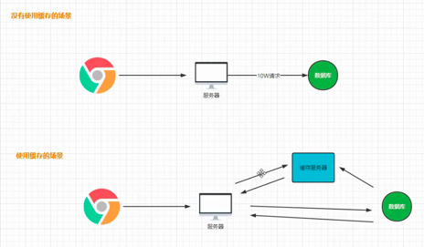
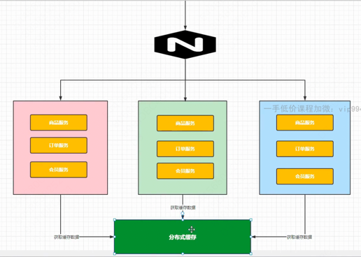

## 10.缓存和分布式锁
### 10.1 什么是缓存?
缓存的目的是降低直接对数据库的访问频率, 从而提高接口性能。



### 10.2 缓存的分类

> 使用使用缓存 and 数据库时, 本地缓存 and 分布式缓存时。怎么保证数据的一致性很重要

> 读多写少的场景适合用缓存, 写多的场景得同时更新缓存和数据库

1. 本地缓存(一级缓存)
将缓存数据存在本地内存中, 比如HashMap。在分布式系统中, 每个节点都有本地缓存, 可能导致缓存数据冗余 缓存效率不高, 因此可以引入分布式缓存(二级缓存)

2. 分布式缓存(二级缓存)
将缓存数据存在分布式缓存服务器中, 比如Redis, 缓存数据很多的情况下, Redis可以横向扩展(主从), 也可以纵向扩展(集群)



### 10.3 整合Redis
新服务器中安装docker, redis; springboot项目整合redis:

1. mall-product服务中添加spring-boot-starter-data-redis依赖
2. 在application.yaml中进行配置
```yaml
spring:
  data:
    redis:
      host: 47.95.17.132
      port: 6379
```
3. 在SpringBootApplicationTest测试类中测试redis, MallProductApplicationTests # testRedis, RedisConfig中新建bean, 测试成功

### 10.4 三级分类缓存
改造三级分类查询缓存: CategoryController # listTree, 具体修改 CategoryServiceImpl # queryPageTree方法

> 后续可将缓存处理的这部分逻辑封装到aop中, 简化代码

测试接口, 成功命中缓存

### 10.5 三级分类压力测试
上一节为 CategoryController # listTree 接口增加了缓存, 这一节用JMeter进行一下该接口的压测

### 10.6 缓存击穿, 缓存穿透, 缓存雪崩
1. 缓存击穿(热点key突然失效 + 大并发请求): 缓存击穿是指一个key非常热点, 在不停的扛着大并发, 大并发集中对这一个点进行访问, 当这个key在失效的瞬间, 大量的请求就击穿了缓存, 直接请求数据库, 产生巨大压力
2. 缓存穿透(请求数据库&缓存中都不存在的key): 缓存穿透是指用户查询数据, 在数据库中不存在, 缓存中也不存在, 直接请求数据库, 产生巨大压力
3. 缓存雪崩(大量key在同一时间过期): 大量缓存数据在同一时间过期（失效）或者 Redis 故障宕机时，如果此时有大量的用户请求，都无法在 Redis 中处理，于是全部请求都直接访问数据库，从而导致数据库的压力骤增，严重的会造成数据库宕机，从而形成一系列连锁反应，造成整个系统崩溃，这就是缓存雪崩

缓存中4个问题: 缓存击穿, 缓存穿透, 缓存雪崩, 缓存与服务一致性的解决方案 -> https://blog.csdn.net/zyhlwzy/article/details/110420098

### 10.7 缓存问题的解决方案
修改 CategoryServiceImpl # queryPageTree方法, 添加缓存击穿, 缓存穿透, 缓存雪崩的解决方案

### 10.8 本地锁的局限性


